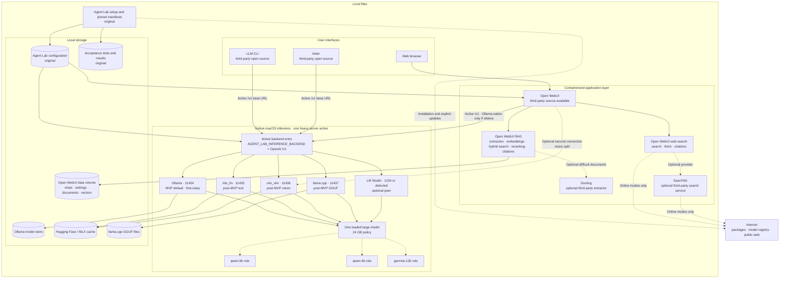

# Agent Lab Design

## Project goal

Agent Lab is an offline-first, local AI assistant for Apple Silicon. It supports
private chat, coding assistance, image understanding, retrieval over local
documents, and optional web search. After the required software and model
weights have been downloaded, its core workflows must operate without an
internet connection.

Agent Lab is an integration project, not a new inference platform. It combines
maintained third-party components behind a tested local configuration and adds
only the policy, setup, evaluation, and compatibility code that is specific to
this project.

## Target hardware

- Apple Silicon, initially an M5 MacBook Air
- 24 GB unified memory
- Local inference on loopback: MVP used native Ollama only; post-MVP (P10)
  selects among first-class OpenAI-compatible backends (`ollama`, `mlx_lm`,
  `mlx_vlm`, `lm_studio`, `llama_cpp`) with one active entry at a time
- Open WebUI and optional supporting services running in containers

## Design principles

1. Reuse maintained software instead of rebuilding standard AI infrastructure.
2. Keep model inference and private data local by default.
3. Load only one large chat model at a time unless measurements prove that
   keeping another model warm is safe.
4. Keep third-party components replaceable through documented protocols and
   configuration.
5. Pin versions and model revisions so the offline installation is
   reproducible.
6. Add custom code only after an integration test demonstrates a missing
   capability.

## Component ownership

### Reused third-party components

| Capability | Component | Status | Agent Lab usage |
| --- | --- | --- | --- |
| Web chat, conversations, tools, RAG, citations, and web search | [Open WebUI](https://github.com/open-webui/open-webui) | Third-party source-available software with branding conditions | Run the pinned container without forking or rebranding it |
| MVP and first-class Ollama backend: model installation, lifecycle, native and OpenAI-compatible APIs | [Ollama](https://github.com/ollama/ollama) | Open source, MIT | Run natively on macOS; qualified local artifacts only; sole MVP entry; post-MVP one selectable backend among peers |
| Direct Apple Silicon text inference | [`mlx_lm.server`](https://github.com/ml-explore/mlx-lm) / [MLX](https://github.com/ml-explore/mlx) | Open source, MIT | Post-MVP first-class `mlx_lm` backend via Hugging Face / MLX weights and OpenAI-compatible `/v1` |
| Direct Apple Silicon vision / multimodal inference | [MLX-VLM](https://github.com/Blaizzy/mlx-vlm) | Open source | Post-MVP first-class `mlx_vlm` backend; optional second Open WebUI connection for vision split |
| Optional local GUI / server peer | [LM Studio](https://lmstudio.ai/) | Third-party application | Post-MVP `lm_studio` backend; detect local OpenAI-compatible server (default port `1234` or documented detection) |
| GGUF / Metal benchmark and fallback server | [llama.cpp](https://github.com/ggml-org/llama.cpp) server | Open source, MIT | Post-MVP first-class `llama_cpp` backend with its own GGUF artifact path |
| General terminal chat, tools, and image input | [LLM CLI](https://github.com/simonw/llm) | Open source, Apache-2.0 | Connect to the active OpenAI-compatible inference base URL; keep Open WebUI-specific RAG integration out of the MVP |
| Repository-aware coding | [Aider](https://github.com/Aider-AI/aider) | Open source, Apache-2.0 | Connect to the active local OpenAI-compatible inference base URL |
| Default vector storage, hybrid retrieval, and reranking | Open WebUI RAG with Chroma | Third-party functionality | Use Open WebUI's implementation and local models rather than build a RAG service |
| Advanced document extraction and OCR | [Docling](https://github.com/docling-project/docling) or an Open WebUI-supported extractor | Open source; optional | Add only when the built-in extractor is insufficient |
| Web search | Open WebUI with DuckDuckGo | Third-party functionality | Use as the initial zero-configuration online search path |
| Self-hosted search aggregation | [SearXNG](https://github.com/searxng/searxng) | Open source; optional | Add as a container when provider control is worth the extra service |
| Ollama model registry and local model store | Ollama model library and `~/.ollama/models` | Third-party functionality | Approve artifacts only for roles whose required capabilities they pass, and record their immutable digests |
| MLX / Hugging Face artifact cache | [Hugging Face Hub](https://github.com/huggingface/huggingface_hub) | Open source client and hosted model registry | Post-MVP cache for `mlx_lm` / `mlx_vlm` pins; separate from Ollama and GGUF stores |
| Prompt and application regression testing | [Promptfoo](https://github.com/promptfoo/promptfoo) | Open source, MIT | Run Agent Lab-owned acceptance cases against the local API |
| Standard multimodal evaluation | [VLMEvalKit](https://github.com/open-compass/VLMEvalKit) | Open source, Apache-2.0 | Use for broader image-understanding comparisons when needed |
| Outbound connection control | [LuLu](https://github.com/objective-see/LuLu) or macOS `pf` | Open source third-party firewall or operating-system facility | Provide strict offline verification; configuration remains an explicit user action |

Open WebUI is a replaceable application dependency rather than the foundation
of a separately branded Agent Lab product. Its current license contains
branding conditions, so Agent Lab will use the upstream application as-is and
keep all original functionality outside its codebase.

The selected language and vision models are open-weight artifacts governed by
their individual licenses. Model license and revision metadata must be recorded
in the download manifest before redistribution or release packaging.

### Agent Lab-original components

Agent Lab owns only the integration-specific layer:

- A version-pinned component manifest and installation documentation
- Container configuration for Open WebUI and optional services
- Native Ollama configuration and post-MVP launch/detect helpers for other
  first-class backends (`mlx_lm`, `mlx_vlm`, `llama_cpp`, `lm_studio`)
- A model catalog containing approved Ollama tags, immutable digests, per-backend
  Hugging Face revisions or GGUF/LM Studio ids, and default inference parameters
- Active-backend selection (`AGENT_LAB_INFERENCE_BACKEND` + OpenAI-compatible
  base URL) as the day-to-day client entry after P10
- Online and offline configuration profiles
- Setup, start, stop, status, health-check, backup, and offline-verification
  scripts
- Small compatibility adapters only when an existing protocol boundary is
  insufficient
- Project-specific acceptance tests and evaluation fixtures
- Hardware-specific benchmark results and default model / backend selection
- Architecture, operational, privacy, and recovery documentation

Agent Lab will not implement a web UI, inference engine, model gateway that
silently multiplexes backends, RAG engine, vector database, document parser,
search broker, page fetcher, coding agent, or general-purpose LLM CLI. The MVP
operated a single inference runtime (Ollama). Post-MVP may install multiple
backends but runs at most one heavy server for day-to-day use on 24 GB hosts
(decision 0011).

## Initial models

| Alias | Approved Ollama artifact | Approved capabilities | Default role |
| --- | --- | --- | --- |
| `qwen-9b` | `qwen3.5:9b` | Text chat, coding, and tools | Chat |
| `qwen-4b` | `qwen3.5:4b` | Fast text chat, lightweight coding, and tools | Fast |
| `gemma-12b` | `gemma4:12b` | Multimodal chat, coding, vision, and tools | Coding and vision |

P0-T03 qualified all three standard artifacts for their declared roles. Both
Qwen artifacts passed deterministic text, code-repair, tool-call, and GPU
execution tests. They accepted and processed image input but failed the fixed
exact-OCR case, so Agent Lab does not advertise either Qwen alias as
vision-capable. Gemma passed text, code-repair, tool-call, GPU, image
understanding, and exact-OCR tests and is the approved multimodal model.

The evidence-based initial defaults are `qwen-9b` for chat, `qwen-4b` for fast
requests, and `gemma-12b` for coding and vision. These assignments establish
safe capability routing; broader quality ranking remains deferred until the
later coding, chat, vision, latency, memory, and model-switch benchmarks.

The earlier `qwen3.5:4b-mlx`, `qwen3.5:9b-mlx`, and `gemma4:12b-mlx` candidates
remain rejected on Ollama 0.32.1 because image input failed, even though their
text, code-repair, and tool-call qualification cases passed. Setup records each
approved standard artifact's immutable manifest digest, expected blobs,
license, disk size, and minimum compatible Ollama version. The MVP also sets
`OLLAMA_MAX_LOADED_MODELS=1` and disables Ollama cloud features.

In a later compatibility phase (P10), Agent Lab may add corresponding
MLX-community repositories through direct `mlx_lm` / `mlx_vlm` and pin their
exact Hugging Face revisions. Ollama, Hugging Face / MLX, llama.cpp GGUF, and
LM Studio libraries are separate copies and are not assumed to share storage.
Direct MLX paths do not reinstate the rejected Ollama `-mlx` artifacts.

## Inference runtime decision

| Runtime | Decision | Reason |
| --- | --- | --- |
| Native Ollama (`ollama`) | MVP sole entry; post-MVP first-class backend | Supplies model pulls, lifecycle, local inference, native API, and OpenAI `/v1`; remains the shipped default until comparative benchmarks may change it |
| `mlx_lm.server` (`mlx_lm`) | Post-MVP first-class text backend | Open-source MLX text server for Hugging Face / MLX weights; OpenAI-compatible `/v1` on a dedicated loopback port |
| MLX-VLM server (`mlx_vlm`) | Post-MVP first-class vision / multimodal backend | Direct Hugging Face multimodal path when operators prefer MLX vision or split text/vision connections |
| LM Studio local server (`lm_studio`) | Post-MVP optional peer | Detect (or safely manage) an existing local OpenAI-compatible server; default app port `1234` or documented detection |
| llama.cpp server (`llama_cpp`) | Post-MVP first-class GGUF / Metal path | Mature Metal and multimodal GGUF runtime with a separate artifact lifecycle from Ollama |

**Active entry (post-MVP):** clients use `AGENT_LAB_INFERENCE_BACKEND` plus the
backend’s OpenAI-compatible base URL. Prefer `/v1` as the common contract.
Ollama-native API is allowed only when the active backend is `ollama`.

**Single-heavy-server policy:** on 24 GB unified memory, run at most one heavy
inference server with a large model loaded for day-to-day use and for
cross-backend benchmarks. Stop or unload before switching backends
(decision 0011).

**No custom gateway:** Agent Lab does not multiplex backends behind one fake
Ollama endpoint. Optional vision split uses an explicit second Open WebUI
connection (for example `mlx_lm` text + `mlx_vlm` vision), not a proxy.

Suggested loopback ports: Ollama `11434`, mlx-lm `11435`, mlx-vlm `11436`,
llama.cpp `11437`, LM Studio `1234` (or detected). Adjust only when a conflict
is documented.

## System architecture



Solid lines show client traffic through the **active backend** entry. MVP
history used Ollama alone on port `11434`; post-MVP the same clients follow
`AGENT_LAB_INFERENCE_BACKEND` and its OpenAI-compatible base URL. Role aliases
`qwen-9b`, `qwen-4b`, and `gemma-12b` remain; only Gemma is advertised for
image input on backends that passed vision gates. Dotted lines denote optional
services, an optional second Open WebUI vision connection, or network access.

Each backend owns its own install, storage, load/unload, and local API. Agent
Lab does not place a custom gateway or supervisor in front of them. Open WebUI
may optionally expose a second connection for a vision split (for example
mlx-lm text + mlx-vlm vision). LLM CLI and Aider target the active `/v1`
endpoint unless the operator selects another explicitly.

## Deployment

### Native macOS processes

Inference servers run outside containers so Apple Silicon acceleration is
available directly. The MVP ran only native Ollama on loopback port `11434`.
Post-MVP (decision 0011), operators select one **active** backend among
`ollama`, `mlx_lm`, `mlx_vlm`, `lm_studio`, and `llama_cpp`. Suggested ports:

| Backend | Loopback port |
| --- | --- |
| `ollama` | `11434` |
| `mlx_lm` | `11435` |
| `mlx_vlm` | `11436` |
| `llama_cpp` | `11437` |
| `lm_studio` | `1234` (LM Studio default) or detected |

Clients prefer the OpenAI-compatible `/v1` API on the active base URL. Open
WebUI may use Ollama’s native API only when the active backend is `ollama`.
No authentication is required on loopback; clients that demand a non-empty key
may use a non-secret placeholder.

When Ollama is active, configuration keeps `OLLAMA_MAX_LOADED_MODELS=1` and
`OLLAMA_NO_CLOUD=1`. Model retention uses `OLLAMA_KEEP_ALIVE` only after
switch-time and memory measurements. All inference listeners remain on loopback
unless a later requirement explicitly authorizes LAN access.

On 24 GB hosts, run at most one heavy inference server with a large model
loaded. Switching backends means stopping or unloading the previous server
before starting the next. MLX and llama.cpp processes use their own pinned
environments and weight caches; they are not started by the MVP freeze path.

### Containers

Open WebUI runs from a pinned upstream container image with a persistent local
data volume. The container reaches the native inference endpoint through
`host.docker.internal` (MVP: Ollama; post-MVP: the active backend’s host port).
Optional SearXNG and Docling services join the same container configuration only
after their need has been demonstrated.

The container runtime is a deployment dependency, not Agent Lab code. Docker
Desktop may be used on macOS; an alternative compatible runtime can be
evaluated separately if licensing or resource usage becomes a concern.

## Interfaces

### Web

Open WebUI owns the ChatGPT-style browser experience, users, conversation
history, file uploads, model presentation, tool presentation, RAG, citations,
and web search. Agent Lab configures its connection to the active local
inference endpoint but does not modify or fork the UI. For the MVP freeze,
Ollama was the only inference connection. Post-MVP, Open WebUI follows the
active backend’s OpenAI-compatible URL; an Ollama-native connection is used only
when that backend is `ollama`. An optional second Open WebUI connection may
expose a vision-split backend (for example `mlx_vlm`) without a custom gateway.

### General CLI

LLM CLI provides one-shot and interactive terminal conversations, model
selection, image attachments, tools, and its own local history. It connects
directly to the active backend’s OpenAI-compatible endpoint (MVP: Ollama
`/v1`). Open WebUI exposes an API, but LLM CLI is not assumed to understand
Open WebUI-specific knowledge collection, tool ID, or conversation-record
extensions.

Shared RAG configuration and synchronized web/CLI conversation history are not
MVP requirements. If either becomes important, Agent Lab may add a small
adapter against documented Open WebUI APIs rather than implement a new CLI
engine.

Agent Lab may later provide a thin convenience command that selects profiles
and delegates to LLM CLI, for example:

```text
agent-lab chat --model qwen-9b
agent-lab ask --image screenshot.png "What is wrong here?"
agent-lab status
agent-lab offline verify
```

The wrapper must not duplicate LLM CLI's conversation, attachment, tool, or
rendering implementation.

### Coding

Aider owns the repository map, prompt construction, edit formats, diffs, Git
integration, and coding loop. It connects to the active backend’s local
OpenAI-compatible endpoint (MVP: Ollama). Agent Lab supplies tested model
settings and compatibility configuration but does not create a competing coding
agent.

## Model lifecycle

The MVP relies on Ollama's existing model manager:

1. The approved catalog maps the three standard artifacts to their qualified
   capabilities and role defaults, with immutable manifest digests.
2. Setup verifies or pulls those exact artifacts without enabling unapproved
   capabilities; image requests resolve to `gemma-12b`.
3. A client sends a request containing an approved Ollama model name or role.
4. Ollama keeps the matching model when appropriate or unloads and loads models
   according to its memory and keep-alive configuration.
5. `OLLAMA_MAX_LOADED_MODELS=1` prevents concurrent large-model residency.
6. `ollama ps` and the local API expose the currently loaded model and runtime
   status.

All clients are configured from the approved model catalog. Offline mode
disables Ollama cloud features and external network access, so a missing model
produces a clear local failure rather than an allowed pull or hosted inference
request.

Agent Lab tests memory release, failed loads, concurrent requests, streaming
interruption, crash recovery, and digest reproducibility. It does not implement
a competing model manager.

Post-MVP (P10), each backend keeps its own artifact store and load/unload
behavior. Agent Lab catalogs per-backend pins for the same role aliases, selects
one active server, and enforces the single-heavy-server policy. MLX, llama.cpp,
and LM Studio expand compatibility and measurement; they do not replace Ollama’s
lifecycle for artifacts Ollama already serves when that backend is active.
Rejected Ollama `*-mlx` tags are not revived.

## Retrieval-augmented generation

Open WebUI provides the complete initial RAG implementation. Agent Lab
configures and tests it but does not own its pipeline. The initial configuration
uses:

1. Open WebUI's built-in extraction for common text, code, image, and PDF
   inputs
2. A downloaded local embedding model
3. Open WebUI's default local Chroma storage
4. Hybrid vector and BM25 retrieval
5. An optional downloaded local cross-encoder reranker
6. Open WebUI context assembly and citations

Docling or another supported local extractor is added only for document types
that fail the built-in acceptance corpus. A heavier external vector database is
not justified for a single-user laptop unless scale or reliability testing
shows that Chroma is insufficient.

Original documents, extracted text, embeddings, retrieved passages, citations,
and chat history stay on the computer. Web results remain temporary context and
are not added to a permanent knowledge collection unless the user explicitly
requests ingestion.

## Online search

Open WebUI supplies search, page retrieval, and citation behavior. DuckDuckGo
is the initial provider. SearXNG is an optional self-hosted broker when multiple
providers or additional privacy controls justify operating another service.
Agent Lab does not implement a search broker or web-page fetcher.

Agent Lab defines three configuration profiles:

- **Offline:** Web search and Ollama cloud features are disabled, remote tools
  are unavailable, model and weight pulls are prohibited, and outbound
  connections are blocked or verified at the operating-system boundary. When
  MLX or Hugging Face paths are installed, those libraries are also forced into
  offline behavior.
- **Online/manual:** Search is available but must be explicitly enabled for the
  request. This is the default online profile.
- **Online/automatic:** Open WebUI may expose search tools for the model to call
  automatically.

Autonomous search may be unreliable with small local models. Agent Lab-owned
tests measure tool selection, query generation, page use, citation correctness,
and refusal to search while offline. Configuration is adjusted from those
results rather than by creating a second search pipeline.

## Evaluation

Agent Lab owns the acceptance cases and hardware results, while third-party
frameworks execute the evaluations:

- Promptfoo compares the three models across chat, instruction following,
  tool-use, RAG, citation, and regression cases.
- VLMEvalKit is used selectively for standardized multimodal comparisons.
- Aider's established workflows and a small fixed repository corpus test code
  edits, test repair, diff quality, and instruction adherence.
- Native measurements record first-token latency, generation speed, peak
  memory, model-switch time, thermal behavior, and failures.

The offline acceptance suite additionally checks that chat, coding, image
understanding, RAG, and conversation storage work after networking is disabled.

## Offline guarantees

After required containers, packages, chat models, embedding models, reranking
models, and extraction assets have been downloaded, the following must work
without internet access:

- Web and terminal chat
- Repository-aware coding
- Image understanding
- Local document ingestion and RAG
- Citations to local source material
- Conversation and settings storage
- Model switching among downloaded models

Offline mode must disable external search providers, remote model APIs,
Ollama cloud features, automatic downloads, update checks, telemetry, and
remote tools. Configuration alone is not considered proof: a strict test using
LuLu, macOS `pf`, or an equivalent network boundary must confirm that normal
offline workflows make no outbound connections.

## Explicit non-goals

### Always out of scope (unless design and plan are revised)

- A custom ChatGPT-style web application
- A custom inference engine or MLX model implementation
- A custom OpenAI-compatible gateway that silently multiplexes backends
- A custom RAG framework, vector database, or reranker
- A custom document parser or OCR engine
- A custom search engine, search broker, or page crawler
- A replacement for LLM CLI or Aider
- Multi-user enterprise deployment, clustering, or horizontal scaling
- Training or fine-tuning foundation models

### MVP-only constraints (historical `v0.1.0-rc.1`)

- Sole inference entry: native Ollama
- No concurrent operation of MLX, llama.cpp, or LM Studio servers as Agent Lab
  backends
- No per-backend Hugging Face / GGUF pin matrix

### Post-MVP multi-entry (P10+, decision 0011)

These are **in scope** after the MVP freeze and are not non-goals:

- First-class backends `ollama`, `mlx_lm`, `mlx_vlm`, `lm_studio`, `llama_cpp`
- Active-backend selection via `AGENT_LAB_INFERENCE_BACKEND` and OpenAI `/v1`
- Optional second Open WebUI connection for vision split
- Single-heavy-server policy on 24 GB hosts
- Comparative multi-backend benchmarks

Still forbidden after P10: a custom multiplexing gateway or supervisor. A
process manager that only starts/stops/detects documented third-party servers
is allowed as integration glue, not as a new inference API.

These boundaries can change only when a measured requirement cannot be met by
configuration, a small adapter, or a maintained third-party component.
