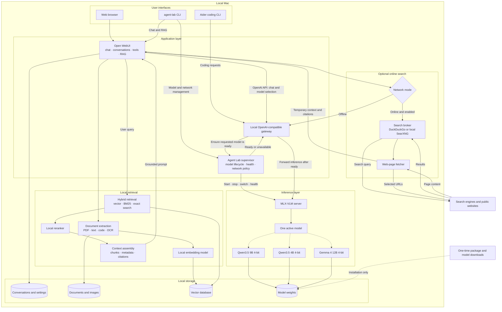

# Agent Lab Design

## Project goal

Agent Lab is an offline-first, local AI assistant for Apple Silicon. It aims to
support private chat, coding assistance, and image understanding without an
internet connection after the required software and model weights have been
downloaded.

## Target hardware

- Apple Silicon, initially an M5 MacBook Air
- 24 GB unified memory
- MLX-based inference

## Initial models

| Role | Model | Purpose |
| --- | --- | --- |
| Primary | `mlx-community/Qwen3.5-9B-4bit` | Balanced chat, coding, image understanding, and tool use |
| Fast | `mlx-community/Qwen3.5-4B-MLX-4bit` | Lower-latency chat and lightweight coding tasks |
| Coding | `mlx-community/gemma-4-12B-it-4bit` | Higher-quality code generation and expanded multimodal evaluation |

The Gemma model is a larger, slower option. It will be evaluated against the
primary Qwen model using the same local coding, vision, latency, and memory
benchmarks before any default model is changed.

## System architecture



## Interfaces

### Web

Open WebUI provides the initial ChatGPT-style web interface. It owns the web
chat experience, conversation history, file uploads, model selection, tool
presentation, citations, and RAG orchestration. It connects to Agent Lab through
the local OpenAI-compatible gateway. For each request, the gateway asks the
supervisor to ensure that the selected model is loaded and healthy before it
forwards inference to MLX-VLM. Open WebUI therefore reaches the supervisor
indirectly and does not need access to its private process-management API.

Open WebUI is used as a replaceable application dependency. Its current license
requires preservation of Open WebUI branding in many deployments, so its source
code will not become the foundation of a separately branded Agent Lab UI.

### CLI

The `agent-lab` CLI supports interactive and one-shot chat, text and image
input, model selection, network-mode control, and access to the same Open WebUI
conversations and knowledge bases. Planned commands include:

```text
agent-lab chat
agent-lab chat --model qwen-9b
agent-lab ask "Explain this repository"
agent-lab ask --image screenshot.png "What is wrong here?"
agent-lab ask --web "Find the latest relevant documentation"
```

Interactive chat will support commands such as `/model`, `/new`, `/history`,
`/web on`, `/web off`, and `/clear`.

### Coding

Aider provides the initial repository-aware terminal coding workflow. It talks
to the same local inference gateway but manages its own repository map, diffs,
Git integration, and edit loop. Agent Lab may replace or augment this client
later if tighter integration with shared conversations and RAG is required.

## Model lifecycle

Only one large chat model is loaded at a time. The supervisor starts and stops
MLX-VLM, exposes health and loading status, and switches models while keeping a
stable gateway URL for clients. All model weights remain on local storage.

The request path is:

1. Open WebUI, Aider, or the CLI sends an OpenAI-compatible request to the
   gateway.
2. The gateway asks the supervisor to prepare the requested model.
3. The supervisor keeps the current model when it matches, or safely stops it
   and starts the requested model.
4. After the supervisor reports readiness, the gateway forwards the inference
   request to MLX-VLM and streams the response back to the client.

Administrative CLI commands may call the supervisor directly for explicit
model switching, status, health, and network-mode management.

The smaller Qwen model may remain warm only when measurements show that doing
so does not create memory pressure. Context limits will start conservatively
and increase only after latency and memory testing.

## Retrieval-augmented generation

Open WebUI provides the first RAG implementation. The local pipeline includes:

1. Extract text and metadata from documents, code, PDFs, and images.
2. Generate embeddings with a dedicated local embedding model.
3. Store embeddings and source metadata in a local vector database.
4. Combine vector similarity with keyword or exact-text retrieval.
5. Rerank candidate passages with a local reranking model.
6. Add selected passages and citations to the model prompt.

Original documents, embeddings, retrieved passages, and chat history stay on
the computer. Web search results are temporary context and are not added to a
permanent knowledge base unless the user explicitly requests ingestion.

The embedding and reranking models must be downloaded during setup so document
retrieval continues to work without a network connection.

## Online search

Open WebUI supplies `search_web` and `fetch_url` tools. The model remains local;
only search queries and requests for selected public pages leave the computer.
Responses are returned to the local model as temporary context with source
metadata for citations.

Agent Lab supports three network modes:

- **Offline:** Outbound networking is blocked and web tools are not exposed to
  the model.
- **Online/manual:** Web tools are available, but each chat or CLI request must
  enable them explicitly. This is the default online mode.
- **Online/automatic:** The model may decide when to search and which result
  pages to fetch.

DuckDuckGo is the initial zero-configuration search provider. A locally hosted
SearXNG instance is the preferred later option for provider flexibility and
greater control. SearXNG still sends search requests to external engines.

Autonomous multi-step search may be unreliable with smaller local models. The
Qwen and Gemma models will be benchmarked for tool selection, query generation,
source fetching, and citation use. If needed, the CLI and supervisor will offer
an explicit search-first workflow that performs retrieval before inference.

## Offline guarantees

After packages, chat models, embedding models, reranking models, and other
required assets have been downloaded, chat, coding, image understanding, local
RAG, and conversation storage must work without internet access.

Offline mode must disable external search providers, remote model APIs,
automatic model downloads, update checks, telemetry, and remote tools. A strict
air-gapped verification test will confirm that normal offline workflows make no
outbound network connections.
