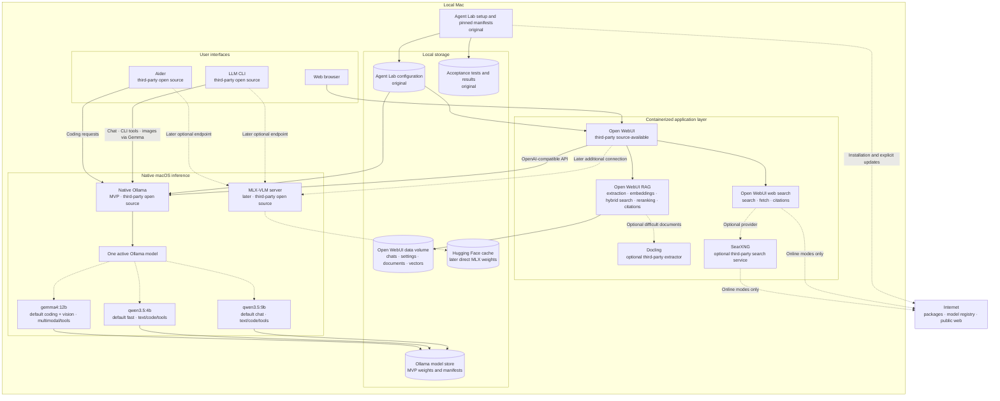

# Agent Lab Design

## Project goal

Agent Lab is an offline-first, local AI assistant for Apple Silicon. It supports
private chat, coding assistance, image understanding, retrieval over local
documents, and optional web search. After the required software and model
weights have been downloaded, its core workflows must operate without an
internet connection.

Agent Lab is an integration project, not a new inference platform. It combines
maintained third-party components behind a tested local configuration and adds
only the policy, setup, evaluation, and compatibility code that is specific to
this project.

## Target hardware

- Apple Silicon, initially an M5 MacBook Air
- 24 GB unified memory
- Ollama inference running natively on macOS for the MVP, using the local
  artifact and backend that pass the required modality tests
- Direct MLX-VLM and Hugging Face integration deferred to a later phase
- Open WebUI and optional supporting services running in containers

## Design principles

1. Reuse maintained software instead of rebuilding standard AI infrastructure.
2. Keep model inference and private data local by default.
3. Load only one large chat model at a time unless measurements prove that
   keeping another model warm is safe.
4. Keep third-party components replaceable through documented protocols and
   configuration.
5. Pin versions and model revisions so the offline installation is
   reproducible.
6. Add custom code only after an integration test demonstrates a missing
   capability.

## Component ownership

### Reused third-party components

| Capability | Component | Status | Agent Lab usage |
| --- | --- | --- | --- |
| Web chat, conversations, tools, RAG, citations, and web search | [Open WebUI](https://github.com/open-webui/open-webui) | Third-party source-available software with branding conditions | Run the pinned container without forking or rebranding it |
| MVP inference, model installation, model lifecycle, and OpenAI-compatible API | [Ollama](https://github.com/ollama/ollama) | Open source, MIT | Run natively on macOS and restrict the server to qualified local artifacts; Ollama selects the compatible native backend |
| Later direct Apple Silicon inference | [MLX-VLM](https://github.com/Blaizzy/mlx-vlm) and [MLX](https://github.com/ml-explore/mlx) | Open source; deferred | Add only for Hugging Face models or low-level controls that Ollama cannot provide |
| General terminal chat, tools, and image input | [LLM CLI](https://github.com/simonw/llm) | Open source, Apache-2.0 | Connect directly to the inference endpoint; keep Open WebUI-specific RAG integration out of the MVP |
| Repository-aware coding | [Aider](https://github.com/Aider-AI/aider) | Open source, Apache-2.0 | Connect directly to the local OpenAI-compatible inference endpoint |
| Default vector storage, hybrid retrieval, and reranking | Open WebUI RAG with Chroma | Third-party functionality | Use Open WebUI's implementation and local models rather than build a RAG service |
| Advanced document extraction and OCR | [Docling](https://github.com/docling-project/docling) or an Open WebUI-supported extractor | Open source; optional | Add only when the built-in extractor is insufficient |
| Web search | Open WebUI with DuckDuckGo | Third-party functionality | Use as the initial zero-configuration online search path |
| Self-hosted search aggregation | [SearXNG](https://github.com/searxng/searxng) | Open source; optional | Add as a container when provider control is worth the extra service |
| MVP model registry and local model store | Ollama model library and `~/.ollama/models` | Third-party functionality | Approve artifacts only for roles whose required capabilities they pass, and record their immutable digests |
| Later model and artifact download cache | [Hugging Face Hub](https://github.com/huggingface/huggingface_hub) | Open source client and hosted model registry; deferred | Add the standard Hugging Face cache when direct MLX-VLM support is introduced |
| Prompt and application regression testing | [Promptfoo](https://github.com/promptfoo/promptfoo) | Open source, MIT | Run Agent Lab-owned acceptance cases against the local API |
| Standard multimodal evaluation | [VLMEvalKit](https://github.com/open-compass/VLMEvalKit) | Open source, Apache-2.0 | Use for broader image-understanding comparisons when needed |
| Outbound connection control | [LuLu](https://github.com/objective-see/LuLu) or macOS `pf` | Open source third-party firewall or operating-system facility | Provide strict offline verification; configuration remains an explicit user action |

Open WebUI is a replaceable application dependency rather than the foundation
of a separately branded Agent Lab product. Its current license contains
branding conditions, so Agent Lab will use the upstream application as-is and
keep all original functionality outside its codebase.

The selected language and vision models are open-weight artifacts governed by
their individual licenses. Model license and revision metadata must be recorded
in the download manifest before redistribution or release packaging.

### Agent Lab-original components

Agent Lab owns only the integration-specific layer:

- A version-pinned component manifest and installation documentation
- Container configuration for Open WebUI and optional services
- Native Ollama configuration and later, if needed, MLX-VLM launch
  configuration
- A model catalog containing approved Ollama tags, immutable digests, later
  Hugging Face revisions, and default inference parameters
- Online and offline configuration profiles
- Setup, start, stop, status, health-check, backup, and offline-verification
  scripts
- Small compatibility adapters only when an existing protocol boundary is
  insufficient
- Project-specific acceptance tests and evaluation fixtures
- Hardware-specific benchmark results and default model selection
- Architecture, operational, privacy, and recovery documentation

Agent Lab will not initially implement a web UI, inference engine, model
gateway, model supervisor, RAG engine, vector database, document parser, search
broker, page fetcher, coding agent, or general-purpose LLM CLI. It will also not
operate two inference runtimes during the MVP.

## Initial models

| Alias | Approved Ollama artifact | Approved capabilities | Default role |
| --- | --- | --- | --- |
| `qwen-9b` | `qwen3.5:9b` | Text chat, coding, and tools | Chat |
| `qwen-4b` | `qwen3.5:4b` | Fast text chat, lightweight coding, and tools | Fast |
| `gemma-12b` | `gemma4:12b` | Multimodal chat, coding, vision, and tools | Coding and vision |

P0-T03 qualified all three standard artifacts for their declared roles. Both
Qwen artifacts passed deterministic text, code-repair, tool-call, and GPU
execution tests. They accepted and processed image input but failed the fixed
exact-OCR case, so Agent Lab does not advertise either Qwen alias as
vision-capable. Gemma passed text, code-repair, tool-call, GPU, image
understanding, and exact-OCR tests and is the approved multimodal model.

The evidence-based initial defaults are `qwen-9b` for chat, `qwen-4b` for fast
requests, and `gemma-12b` for coding and vision. These assignments establish
safe capability routing; broader quality ranking remains deferred until the
later coding, chat, vision, latency, memory, and model-switch benchmarks.

The earlier `qwen3.5:4b-mlx`, `qwen3.5:9b-mlx`, and `gemma4:12b-mlx` candidates
remain rejected on Ollama 0.32.1 because image input failed, even though their
text, code-repair, and tool-call qualification cases passed. Setup records each
approved standard artifact's immutable manifest digest, expected blobs,
license, disk size, and minimum compatible Ollama version. The MVP also sets
`OLLAMA_MAX_LOADED_MODELS=1` and disables Ollama cloud features.

In a later compatibility phase, Agent Lab may add corresponding MLX-community
repositories through direct MLX-VLM and pin their exact Hugging Face revisions.
Ollama and Hugging Face artifacts are separate copies and are not assumed to
share storage. This deferred direct MLX-VLM path does not reinstate the rejected
Ollama `-mlx` artifacts.

## Inference runtime decision

| Runtime | Decision | Reason |
| --- | --- | --- |
| Native Ollama | MVP | One open-source service supplies model pulls, lifecycle management, local inference, and OpenAI-compatible APIs; each artifact is exposed only for the text, code, tools, or image capabilities it passed |
| MLX-VLM server | Later compatibility phase | Provides direct Hugging Face access and lower-level multimodal controls when Ollama lacks a model or feature |
| `mlx_lm.server` | Not selected for the unified endpoint | It is an open-source MIT server from Apple's MLX project, but its documented server is for text generation rather than image input |
| llama.cpp server | Benchmark fallback | Mature Metal and multimodal GGUF runtime, but it requires a separate artifact and lifecycle path from the approved Ollama artifacts |

`mlx_lm.server` remains valuable for a future dedicated text-only model,
especially if a coding benchmark shows an advantage. It is not the initial
server because Agent Lab requires chat, coding, and image understanding through
the same endpoint. Running MLX-LM for text and MLX-VLM for images would add two
Python servers and duplicate lifecycle coordination that Ollama already
provides.

## System architecture



The solid lines show the MVP path through native Ollama. All three model nodes
are approved for their labeled roles: Qwen 9B is the chat default, Qwen 4B is
the fast default, and Gemma 12B is the coding and vision default. Only Gemma is
advertised for image input because the Qwen artifacts failed the fixed OCR
qualification. Dotted lines denote optional services, later-phase direct
MLX-VLM access, or network access. Ollama owns model installation, storage,
loading, unloading, backend selection, inference, and the local API. Agent Lab
does not place a custom gateway or supervisor in front of it.

When direct Hugging Face access is added later, Open WebUI may expose Ollama and
MLX-VLM as two separate model connections. LLM CLI and Aider select the desired
endpoint explicitly. This avoids introducing a gateway merely to combine two
already compatible APIs.

## Deployment

### Native macOS processes

Ollama runs outside containers so its native inference backends can use Apple
Silicon acceleration directly. The qualified artifact determines the backend
Ollama uses; the design does not require an MLX-only Ollama path. Ollama exposes
its local API on loopback port `11434`; no authentication is needed on that
local endpoint. Open WebUI uses Ollama's native API or its OpenAI-compatible
`/v1` API, while LLM CLI and Aider use the OpenAI-compatible API.

The MVP configuration sets `OLLAMA_MAX_LOADED_MODELS=1` to protect the 24 GB
unified-memory budget and `OLLAMA_NO_CLOUD=1` to disable cloud models and
Ollama-provided web search. Model retention is tuned with
`OLLAMA_KEEP_ALIVE` only after switch-time and memory measurements. The server
remains bound to loopback unless a later requirement explicitly authorizes LAN
access.

Direct MLX-VLM is a later native service with its own pinned Python environment
and Hugging Face cache. It is not installed or started in the MVP.

### Containers

Open WebUI runs from a pinned upstream container image with a persistent local
data volume. The container reaches the native inference endpoint through
`host.docker.internal`. Optional SearXNG and Docling services join the same
container configuration only after their need has been demonstrated.

The container runtime is a deployment dependency, not Agent Lab code. Docker
Desktop may be used on macOS; an alternative compatible runtime can be
evaluated separately if licensing or resource usage becomes a concern.

## Interfaces

### Web

Open WebUI owns the ChatGPT-style browser experience, users, conversation
history, file uploads, model presentation, tool presentation, RAG, citations,
and web search. Agent Lab configures its connection to the local inference
endpoint but does not modify or fork the UI. Ollama is the only inference
connection required in the MVP; MLX-VLM appears as a second connection only in
the later Hugging Face compatibility phase.

### General CLI

LLM CLI provides one-shot and interactive terminal conversations, model
selection, image attachments, tools, and its own local history. It connects
directly to Ollama's OpenAI-compatible endpoint. Open WebUI exposes an API, but
LLM CLI is not assumed to understand Open WebUI-specific knowledge collection,
tool ID, or conversation-record extensions.

Shared RAG configuration and synchronized web/CLI conversation history are not
MVP requirements. If either becomes important, Agent Lab may add a small
adapter against documented Open WebUI APIs rather than implement a new CLI
engine.

Agent Lab may later provide a thin convenience command that selects profiles
and delegates to LLM CLI, for example:

```text
agent-lab chat --model qwen-9b
agent-lab ask --image screenshot.png "What is wrong here?"
agent-lab status
agent-lab offline verify
```

The wrapper must not duplicate LLM CLI's conversation, attachment, tool, or
rendering implementation.

### Coding

Aider owns the repository map, prompt construction, edit formats, diffs, Git
integration, and coding loop. It connects to Ollama's local OpenAI-compatible
endpoint in the MVP. Agent Lab supplies tested model settings and compatibility
configuration but does not create a competing coding agent.

## Model lifecycle

The MVP relies on Ollama's existing model manager:

1. The approved catalog maps the three standard artifacts to their qualified
   capabilities and role defaults, with immutable manifest digests.
2. Setup verifies or pulls those exact artifacts without enabling unapproved
   capabilities; image requests resolve to `gemma-12b`.
3. A client sends a request containing an approved Ollama model name or role.
4. Ollama keeps the matching model when appropriate or unloads and loads models
   according to its memory and keep-alive configuration.
5. `OLLAMA_MAX_LOADED_MODELS=1` prevents concurrent large-model residency.
6. `ollama ps` and the local API expose the currently loaded model and runtime
   status.

All clients are configured from the approved model catalog. Offline mode
disables Ollama cloud features and external network access, so a missing model
produces a clear local failure rather than an allowed pull or hosted inference
request.

Agent Lab tests memory release, failed loads, concurrent requests, streaming
interruption, crash recovery, and digest reproducibility. It does not implement
a competing model manager. MLX-VLM and Hugging Face are added later only to
expand model compatibility, not to replace Ollama lifecycle management for
models Ollama already serves well.

## Retrieval-augmented generation

Open WebUI provides the complete initial RAG implementation. Agent Lab
configures and tests it but does not own its pipeline. The initial configuration
uses:

1. Open WebUI's built-in extraction for common text, code, image, and PDF
   inputs
2. A downloaded local embedding model
3. Open WebUI's default local Chroma storage
4. Hybrid vector and BM25 retrieval
5. An optional downloaded local cross-encoder reranker
6. Open WebUI context assembly and citations

Docling or another supported local extractor is added only for document types
that fail the built-in acceptance corpus. A heavier external vector database is
not justified for a single-user laptop unless scale or reliability testing
shows that Chroma is insufficient.

Original documents, extracted text, embeddings, retrieved passages, citations,
and chat history stay on the computer. Web results remain temporary context and
are not added to a permanent knowledge collection unless the user explicitly
requests ingestion.

## Online search

Open WebUI supplies search, page retrieval, and citation behavior. DuckDuckGo
is the initial provider. SearXNG is an optional self-hosted broker when multiple
providers or additional privacy controls justify operating another service.
Agent Lab does not implement a search broker or web-page fetcher.

Agent Lab defines three configuration profiles:

- **Offline:** Web search and Ollama cloud features are disabled, remote tools
  are unavailable, model pulls are prohibited, and outbound connections are
  blocked or verified at the operating-system boundary. In the later direct
  MLX-VLM phase, Hugging Face libraries are also forced into offline behavior.
- **Online/manual:** Search is available but must be explicitly enabled for the
  request. This is the default online profile.
- **Online/automatic:** Open WebUI may expose search tools for the model to call
  automatically.

Autonomous search may be unreliable with small local models. Agent Lab-owned
tests measure tool selection, query generation, page use, citation correctness,
and refusal to search while offline. Configuration is adjusted from those
results rather than by creating a second search pipeline.

## Evaluation

Agent Lab owns the acceptance cases and hardware results, while third-party
frameworks execute the evaluations:

- Promptfoo compares the three models across chat, instruction following,
  tool-use, RAG, citation, and regression cases.
- VLMEvalKit is used selectively for standardized multimodal comparisons.
- Aider's established workflows and a small fixed repository corpus test code
  edits, test repair, diff quality, and instruction adherence.
- Native measurements record first-token latency, generation speed, peak
  memory, model-switch time, thermal behavior, and failures.

The offline acceptance suite additionally checks that chat, coding, image
understanding, RAG, and conversation storage work after networking is disabled.

## Offline guarantees

After required containers, packages, chat models, embedding models, reranking
models, and extraction assets have been downloaded, the following must work
without internet access:

- Web and terminal chat
- Repository-aware coding
- Image understanding
- Local document ingestion and RAG
- Citations to local source material
- Conversation and settings storage
- Model switching among downloaded models

Offline mode must disable external search providers, remote model APIs,
Ollama cloud features, automatic downloads, update checks, telemetry, and
remote tools. Configuration alone is not considered proof: a strict test using
LuLu, macOS `pf`, or an equivalent network boundary must confirm that normal
offline workflows make no outbound connections.

## Explicit non-goals for the initial implementation

- A custom ChatGPT-style web application
- A custom inference engine or MLX model implementation
- A custom OpenAI-compatible gateway
- A custom model supervisor or process manager
- A custom RAG framework, vector database, or reranker
- A custom document parser or OCR engine
- A custom search engine, search broker, or page crawler
- A replacement for LLM CLI or Aider
- Multi-user enterprise deployment, clustering, or horizontal scaling
- Training or fine-tuning foundation models

These boundaries can change only when a measured requirement cannot be met by
configuration, a small adapter, or a maintained third-party component.
