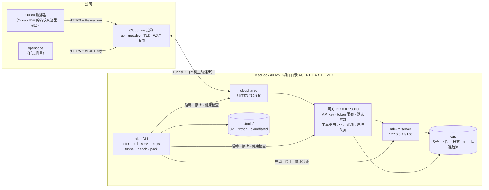

# Agent Lab 技术设计：在 MacBook Air M5（24GB）上部署 Qwen3.8-27B，并通过 api.llmat.dev 对外提供服务

- 状态：已评审，待实现
- 日期：2026-10-04
- 修订记录：
  - 2026-10-04 初版（PR #2），取代 2026-07-18 的旧设计。
  - 2026-10-04 修订：去掉 Ollama，只用 mlx-lm；新增公网访问（`api.llmat.dev`），支持 Cursor 和 opencode 接入。
- 任务拆分：见 [`docs/tasks/README.md`](tasks/README.md)

## 0. 结论摘要

| 问题 | 结论 |
| --- | --- |
| 模型 | `Qwen/Qwen3.8-27B`（27B dense，混合注意力，Apache 2.0，2026-08 发布） |
| 量化 | **4-bit（Q4）**。3-bit 只作为内存吃紧时的后备 |
| 运行时 | **只用 mlx-lm**。Ollama、LM Studio、llama.cpp 都不纳入 |
| 成熟度 | mlx-lm 已支持该模型的架构；但 mlx-lm 对 Qwen3.5 之后非 Coder 模型的**工具调用解析还不可靠**，这是接入 Cursor 和 opencode 的头号风险（第 7.4 节） |
| Context | **默认 32K**，前提是 prompt cache 不额外复制一份 KV（第 4.2 节，T06 实测）；否则降到 24K。64K 不开放 |
| 思考模式 | 默认**关闭**，可按请求打开。本机只有约 6–9 tok/s，默认的 `xhigh` 思考不可接受 |
| 对外访问 | **`https://api.llmat.dev/v1`**，通过 Cloudflare Tunnel 暴露（域名已托管在 Cloudflare）。本机不开放任何入站端口 |
| 鉴权 | 所有请求都必须带 Bearer API key，包括本机请求；每个客户端一个 key，可单独吊销 |
| 客户端 | **Cursor**（需要 Pro 计划；请求从 Cursor 的服务器发出，所以必须是公网地址）和 **opencode** |
| 同级替代 | Gemma 4 26B-A4B（MoE，速度快约 3–5 倍，能力明显弱）作为可选"快速档"；其余同级模型在 24GB 上不合适 |
| 隔离与打包 | 工具链、Python、依赖、模型、cloudflared、密钥全部在项目目录内；不装 Homebrew、不改全局 Python、不注册后台服务；支持打成离线包部署到其他 Mac |
| 唯一的系统级改动 | 临时提高 GPU 可用内存上限（`sysctl iogpu.wired_limit_mb`），需显式确认，重启自动恢复 |

本文中的数字分三类：**[实测/官方]** 来自模型卡或第三方实测，**[估算]** 是根据架构参数推算的，**[待验证]** 必须在目标机器上实测确认（主要在 T06 基准测试中完成）。

## 1. 目标与非目标

### 目标

1. 在一台 MacBook Air M5、24GB 统一内存的机器上，稳定运行 Qwen3.8-27B。
2. 通过 `https://api.llmat.dev/v1` 提供 OpenAI 兼容接口，Cursor 和 opencode 都能接入，并能使用它们的 agent（工具调用）功能。
3. 环境完全自包含：不破坏本机已有的 Python、Homebrew、Ollama 等任何环境，删除项目目录即可完全卸载。
4. 可打包、可迁移：同一套配置能打成离线包，在另一台 Apple Silicon Mac 上无需联网即可部署；公网入口换一台机器也只需要换一个 tunnel token。
5. 内存可预测：任何请求都不能把机器拖进大量 swap 或卡死。
6. 公网暴露安全：没有有效 key 的请求进不到推理服务；被滥用时能快速吊销。
7. 有可复现的基准测试，用数据决定 context 档位。

### 非目标（v1 不做）

- 网页聊天界面、RAG、联网搜索、多模型同时常驻。
- 图像/视频输入。视觉塔会额外占用约 0.9GB，在 24GB 上直接挤占 context。将来通过 mlx-vlm 增加，单独开设计。
- Ollama 后端（2026-10-04 决定不做）。
- 端口转发、开放入站端口、自建反向代理服务器。公网流量只经过 Cloudflare Tunnel。
- 多用户计费、配额管理。v1 只有"一个 key 一个客户端"的简单模型。
- Cursor 的 Tab 补全。Cursor 的 Tab 补全不走自定义模型 [实测/官方]，本方案无法替代。
- Docker。macOS 上的 Docker 无法使用 Metal GPU。
- Linux/NVIDIA 部署（只预留接口，第 8.4 节）。

## 2. 硬件约束

| 项目 | 数值 | 来源 |
| --- | --- | --- |
| 统一内存 | 24GB | 用户机器 |
| 内存带宽 | 约 142 GB/s（STREAM 实测），比 M4 高约 26% | [实测/官方] MindStudio |
| 散热 | 无风扇，持续负载下有约 6% 的降频 | [实测/官方] MindStudio |
| GPU 默认可用内存 | 由内核按物理内存推导，24GB 机型约 16–18GB | [实测/官方]，具体值以 `doctor` 读到的数为准 [待验证] |
| 睡眠 | 合盖或空闲会睡眠，睡眠期间公网服务不可用 | 第 7.5 节 |

两个直接后果：

- **解码速度受带宽限制。** 每生成一个 token 要把约 15GB 的 4-bit 权重读一遍，理论上限约 142 / 15 ≈ 9.5 tok/s，实际预计 **6–9 tok/s** [估算]。
- **默认 GPU 内存上限装不下。** 4-bit 权重约 15GB，已接近默认上限，必须临时提高上限（第 4.3 节）。

## 3. 模型与量化选型

### 3.1 Qwen3.8-27B 关键参数 [实测/官方]

| 项目 | 数值 |
| --- | --- |
| 参数量 | 27B，dense |
| 层结构 | 64 层：16 组 ×（3 层 Gated DeltaNet 线性注意力 + 1 层 Gated Attention） |
| 全注意力层 | 16 层，24 个 Q 头，**4 个 KV 头**，head dim 256 |
| 原生 context | 262,144；YaRN 可扩展到约 1M |
| 模态 | 文本、图像、视频 |
| 思考模式 | 默认开启，`reasoning_effort` 可选 xhigh / medium / low |
| 推荐采样 | 思考：T=1.0, top_p=0.95, top_k=20；非思考：T=0.7, top_p=0.8, top_k=20 |
| Agent 能力 | SWE-bench Pro 61.7%，OSWorld-Verified 84.3%；同机测试中 90 次单步工具调用全部有效，30 次多步工具调用 28 次有效 |
| 许可证 | Apache 2.0 |

混合注意力是这个模型能在 24GB 上开到可用 context 的关键：只有 16 层全注意力层需要 KV cache，48 层线性注意力层只保存固定大小的状态。

### 3.2 Q4 还是 Q3

GGUF 社区量化与 BF16 的对比 [实测/官方，kingy.ai 汇总]：

| 量化 | 文件大小 | KL 散度 | Top-1 一致率 |
| --- | --- | --- | --- |
| Q3（IQ3_S） | 13.8GB | 0.0325 | 92.4% |
| Q4（Q4_K_M / UD-Q4_K_XL） | 16.8–17.9GB | 0.0096–0.0113 | 95.5–96.0% |
| Q5（UD-Q5_K_XL） | 20.2GB | 0.0044 | 97.3% |

MLX 格式 [实测/官方]：`mlx-community/Qwen3.8-27B-4bit` 共 16.1GB（含 bf16 视觉塔约 0.9GB），mlx-lm 以纯文本方式加载时权重约 **15.0GB**。目前没有找到官方或 mlx-community 发布的 Qwen3.8-27B 3-bit MLX 版本，需要时可用 `mlx_lm.convert` 自行转换。

**结论：使用 Q4。**

- Q3 的 KL 散度约是 Q4 的 3 倍，Top-1 一致率低约 3–4 个百分点，第三方评价是"受限但可用、质量损失可见"。对 agent 场景来说，工具调用格式出错的代价很高，不值得用质量换内存。
- Q3 只能省出约 3GB，相当于多出约 45K token 的 KV 空间（第 4 节的算法）。
- 不选 Q5/Q6：Q5 约 20GB，在 24GB 机器上几乎不剩 context 空间。
- Q3 保留为后备：如果 T06 实测发现 Q4 在 24K 下仍然内存压力过大，再评估自转换的 3-bit 或 3/4 混合精度版本。

### 3.3 运行时：只用 mlx-lm

| 运行时 | 支持情况 | 结论 |
| --- | --- | --- |
| **mlx-lm** | 自 v0.30.7 起支持 Qwen3.5 系列纯文本推理；Qwen3.8-27B 与 Qwen3.5/3.6-27B 层结构相同，mlx-community 的 4-bit 版本月下载量约 17.7 万 [实测/官方]。Qwen3.8 是否沿用同一 `model_type`、需要的最低版本 [待验证，T04] | **采用** |
| Ollama | v0.32.12 起支持，`qwen3.8:27b-mlx` 18GB（含视觉）[实测/官方] | 不采用（2026-10-04 决定） |
| LM Studio | 有 MLX 和 GGUF 版本 | 不采用：GUI 应用，难以自包含和打包 |
| llama.cpp | 有 GGUF 版本 | 不采用 |

选择 mlx-lm 的理由：纯文本加载约 15GB，比 Ollama 的 18GB 省约 3GB，相当于约 45K token 的 KV 空间；它就是一个锁定版本的 Python 包，最容易自包含和打包；采样参数、chat template 参数、prefill 分块、prompt cache 上限都能在启动参数里设定。

**mlx-lm 的已知短板，以及本设计如何补上：**

| 短板 | 补救 |
| --- | --- |
| `mlx_lm.server` 没有硬性的 context 上限，KV cache 随请求增长；已发布版本没有 `--kv-bits` [实测/官方] | 网关按 token 数限额（第 6.3 节）；后端并发设为 1 |
| 默认并发是 32，KV 会按并发数放大 | `--decode-concurrency 1`、`--prompt-concurrency 1`，排队由网关负责 |
| 内存耗尽时可能触发内核 panic 而不是报错：有人在 M4 Max 上跑混合注意力模型、KV 无上限增长时遇到 `IOGPUMemory.cpp` panic [实测/官方] | 用一个很薄的启动包装在启动 server 前调用 `mx.set_memory_limit()`（或同等接口），把超限变成可捕获的 Python 异常；再加上网关限额，两道保险 |
| 对 Qwen3.5/3.6 非 Coder 模型，server 的工具调用解析器自动检测会失败，表现为传了 tools 却返回空内容 [实测/官方，mlx-lm issue #1293] | 见第 7.4 节：先尝试显式指定 `qwen3_coder` 解析器；不行则由网关自己解析工具调用 |

### 3.4 同级别的其他模型

| 模型 | 类型 | 4-bit 大小 | 与 Qwen3.8-27B 对比 | 在 24GB 上的结论 |
| --- | --- | --- | --- | --- |
| **Gemma 4 26B-A4B** | MoE，激活约 4B | 约 15GB | HLE 17.2% 对 30.8%，能力明显弱；但每 token 只读约 4B 参数，解码预计快 3–5 倍 [估算] | **作为"快速档"候选**，在 T10 评估 |
| Gemma 4 31B | dense | 约 17.1GiB（Q4_K_M） | 同机测试中编程 6/12 对 12/12；64K 需要 Q8 KV 才能放下 | 不选：更大、更慢、更弱 |
| Qwen3.6-27B | dense，同架构 | 约 15.7GiB | 内存曲线完全相同，但编程 8/12、文档问答 8/24，明显落后 | 不选：被 3.8 全面替代 |
| Qwen3.6-35B-A3B | MoE，激活约 3B | 约 20GB [估算] | 速度快 | 不选：4-bit 在 24GB 上几乎没有 context 空间 |
| Qwen3.8 其他尺寸 | Flash-Next（180B-A6B）、2.4T-A95B | 远超 24GB | — | 不可行。Qwen3.8 系列中只有 27B 能在单机消费级硬件上运行 |

同机对比数据来自 kingy.ai 在 RTX 4090 24GB 上的测试 [实测/官方]，结论是"Qwen3.8-27B 是本地综合用途的最佳默认选择"。在 24GB 档位，**没有比 Qwen3.8-27B 更强、又能放得下的模型**。

## 4. 内存预算与 context 长度

### 4.1 KV cache 大小 [估算，与第三方数据一致]

每个 token 的 KV cache = 16 层 × 4 个 KV 头 × 256 维 × 2（K 和 V）× 2 字节（fp16）= **65,536 字节 = 64KiB**。

线性注意力层的状态是固定大小，约 48 层 × 48 头 × 128 × 128 × 4 字节 ≈ 0.15GB，与 context 长度无关 [估算]。

| Context | KV cache（fp16） |
| --- | --- |
| 8K | 0.5GiB |
| 24K | 1.5GiB |
| 32K | 2.0GiB |
| 64K | 4.0GiB |
| 128K | 8.0GiB |

### 4.2 预算表（Q4，纯文本）[估算，T06 验证]

Cursor 和 opencode 这类 agent 每一轮都会把完整对话重新发过来。如果 prompt cache 存不下当前会话，每一轮都要重新 prefill 全部上下文，在本机上会慢到不可用（第 5 节）。所以 prompt cache 必须至少能放下**一个满长度的会话**，这块内存必须算进预算。

关键的未知数是：mlx-lm 复用缓存时，是把缓存"拿出来接着用"，还是"复制一份再用"。两种情况的预算不同：

| 项目 | 32K，缓存不复制 | 32K，缓存复制 | 24K，缓存复制 |
| --- | --- | --- | --- |
| 权重 | 15.0GB | 15.0GB | 15.0GB |
| 当前请求的 KV cache | 2.1GB | 2.1GB | 1.6GB |
| prompt cache（1 个会话） | 与上一行共用 | 2.1GB | 1.6GB |
| 线性层状态 + 激活 + prefill 分块缓冲 + 框架开销 | 约 1.0–1.5GB | 约 1.0–1.5GB | 约 1.0–1.5GB |
| **推理进程合计** | **约 18.1–18.6GB** | **约 20.2–20.7GB** | **约 19.2–19.7GB** |
| 留给 macOS 和其他应用 | 约 5.5GB | 约 3.5GB | 约 4.5GB |

第三方在 RTX 4090 上的实测可作参照：Q4_K_M（GGUF，16GiB）在 32K 时峰值 18.2GiB，64K 时 20.3GiB [实测/官方]。

**结论：**

- **默认档 32K**，`prompt_cache_bytes` 设为能放下一个 32K 会话（约 2.1GB），缓存条目数为 1。
- **T06 第一项测量就是确认缓存是否复制。** 如果复制，默认档降为 **24K**。这一点对 opencode 影响不大，它会按配置的 context 自动压缩对话；对 Cursor 影响较大，见第 7.4 节。
- **64K 不开放。** 它要求 GPU 上限提到 22GB 左右，macOS 只剩约 2GB，而 wired 内存无法换出，卡死风险过高。只有 mlx-lm 发布 KV 量化参数、或改用 Q3 且实测达标后才考虑。
- 128K 及以上在 24GB 上不可行。有人估算 24GB 机器能开 64K–96K，那是没有给 macOS 留余量的算法，本设计不采用。

### 4.3 GPU 内存上限

macOS 默认只允许 GPU 锁定约 2/3 到 3/4 的统一内存。24GB 机器的默认值约 16–18GB，装不下 15GB 权重加 KV cache。做法：

- 使用 `sudo sysctl iogpu.wired_limit_mb=<值>` 临时提高上限。**重启后自动恢复默认值**，不留下永久改动。
- 推荐值：**20480MB（20GB）** [待验证，T06 确认]。第三方在 24GB M4 上使用 21504MB 跑通了 27B MLX 模型 [实测/官方]，本设计以此为硬上限，不超过这个值。
- 风险：wired 内存无法被换出，设得过高会让系统卡顿甚至死机。因此工具只提供"应用/查看/恢复"三个显式命令，每次应用前都要求确认，并且不安装开机自启的 LaunchDaemon。
- 这是本方案**唯一**需要 sudo 的操作。

## 5. 思考模式与性能预期

| 指标 | 预期 | 依据 |
| --- | --- | --- |
| 解码 | 6–9 tok/s | [估算] 带宽 142GB/s ÷ 权重 15GB |
| Prefill | 每秒数百 token 量级；M5 GPU 内置神经加速器对矩阵运算有加速 | [待验证] |
| agent 首轮（约 10K token 的系统提示和工具定义） | 可能需要 30 秒到 1 分钟 | [估算，待验证] |
| agent 后续每轮（命中 prompt cache，只 prefill 新增内容） | 新增几百到几千 token，数秒到十几秒，加上生成时间 | [估算，待验证] |
| 未命中缓存的 32K 长提示 | 可能需要 2–5 分钟 | [估算，待验证] |

Qwen3.8-27B 默认以 `xhigh` 强度思考。Simon Willison 的测试中，同一个任务开思考要 21 分钟，关掉只要 2 分钟 [实测/官方，M5 Max 128GB，比本机快得多]。因此：

- 服务默认**关闭思考**（chat template 参数 `enable_thinking=false`）。
- 客户端可在单个请求里通过 `reasoning_effort` 打开思考。由于 mlx-lm 已知"单请求修改 chat template 参数会绕过 prompt cache"的问题 [实测/官方，mlx-lm issue #1803]，开思考的请求会损失缓存命中。
- 采样参数按模型卡推荐值分两套（思考/非思考），客户端未指定时由网关补上。

**对使用体验的诚实预期：** 这台机器上的 27B 适合"交给它一个任务、过几分钟回来看结果"的用法，不适合需要即时响应的交互。Cursor 和 opencode 的 agent 一次任务通常有十几到几十轮工具调用，总耗时可能在十几分钟以上。

可选加速（不进 v1 默认路径）：社区已有 `Qwen3.8-27B-MTP-4bit`（多 token 预测），在其他机器上有约 72% 的提速 [实测/官方]。mlx-lm 是否支持 MTP 推理 [待验证]，在 T06 中顺带评估。

## 6. 总体架构


```mermaid
flowchart LR
    subgraph Remote["公网"]
        CursorSrv["Cursor 服务器<br/>（Cursor IDE 的请求从这里发出）"]
        OpenCode["opencode<br/>（任意机器）"]
        Edge["Cloudflare 边缘<br/>api.llmat.dev · TLS · WAF 限流"]
    end

    subgraph Mac["MacBook Air M5（项目目录 AGENT_LAB_HOME）"]
        CF["cloudflared<br/>只建立出站连接"]
        GW["网关 127.0.0.1:8000<br/>API key · token 限额 · 默认参数<br/>工具调用 · SSE 心跳 · 串行队列"]
        MLX["mlx-lm server<br/>127.0.0.1:8100"]
        CLI["alab CLI<br/>doctor · pull · serve · keys · tunnel · bench · pack"]
        Store[("var/<br/>模型 · 密钥 · 日志 · pid · 基准结果")]
        Tool[(".tools/<br/>uv · Python · cloudflared")]
    end

    CursorSrv -->|HTTPS + Bearer key| Edge
    OpenCode -->|HTTPS + Bearer key| Edge
    Edge <-->|"Tunnel（由本机主动连出）"| CF
    CF --> GW
    GW --> MLX
    CLI -->|"启动 · 停止 · 健康检查"| CF
    CLI -->|"启动 · 停止 · 健康检查"| GW
    CLI -->|"启动 · 停止 · 健康检查"| MLX
    MLX --> Store
    GW --> Store
    CLI --> Tool
```

本机上的 opencode 也可以直接用 `http://127.0.0.1:8000/v1`，同样需要 API key。

### 6.1 组件

| 组件 | 职责 | 实现 |
| --- | --- | --- |
| `bootstrap.sh` | 唯一的入口脚本：把锁定版本的 uv 和 cloudflared 下载到 `.tools/`，用 uv 安装锁定版本的 Python 和依赖到项目内 | POSIX shell，校验下载文件的 sha256 |
| `alab` CLI | 环境检查、模型下载、启停服务、管理 key、启停 tunnel、基准测试、打包 | Python 包 `agent_lab`，入口 `alab` |
| 网关 | 唯一对外的 HTTP 端点：鉴权、token 限额、补默认参数、思考开关、工具调用兼容、SSE 心跳、串行队列 | Python ASGI 应用（Starlette、httpx、uvicorn），单进程；token 计数复用 mlx-lm 已经依赖的 `transformers` tokenizer |
| 推理后端 | 运行 `mlx_lm.server` 子进程；启动前设置 Metal 内存上限 | 锁定版本的 mlx-lm，加一个很薄的启动包装 |
| cloudflared | 把 `api.llmat.dev` 的流量经 Cloudflare Tunnel 转到网关 | 锁定版本的 cloudflared 二进制，作为 `alab` 管理的子进程运行，不注册系统服务 |

**为什么需要网关：**

1. mlx-lm 不限制 context 长度，网关是防止 OOM 的第一道闸门。
2. 公网暴露必须有鉴权，mlx-lm server 自己没有，并且官方说明它不适合生产暴露 [实测/官方]。
3. Cloudflare 在约 100 秒内收不到数据就会断开连接，而本机 prefill 可能更久，需要网关发心跳（第 7.3 节）。
4. 客户端要求的工具调用格式和模型实际输出之间可能需要转换（第 7.4 节）。
5. 端口和模型名固定，换机器、换 mlx-lm 版本时客户端配置不变。

网关刻意保持很薄：不做对话存储、不做多模型路由、不做计费。

### 6.2 目录结构

```text
agent-lab/
├── bootstrap.sh              # 唯一入口：安装工具链
├── alab                      # 包装脚本：加载 .tools/env.sh 后调用 CLI
├── pyproject.toml / uv.lock  # 依赖锁定
├── config/
│   ├── models.toml           # 模型注册表：仓库、revision、sha256、大小
│   ├── tools.toml            # uv、cloudflared 的版本和 sha256
│   └── profiles/
│       ├── mac-24gb.toml     # 本机默认档：32K（或 T06 定稿后的值）
│       └── mac-32gb-plus.toml
├── src/agent_lab/            # CLI、网关、后端启动包装
├── tests/
├── docs/
├── .tools/                   # 不入库：uv、Python、cloudflared
└── var/                      # 不入库：models/、logs/、run/、bench/、secrets/
```

所有运行时路径都从环境变量 `AGENT_LAB_HOME` 推导，默认是仓库根目录。`var/secrets/` 权限为 700，里面的文件权限为 600。

### 6.3 网关 API 契约

**接口：**

- `POST /v1/chat/completions`：OpenAI 兼容，支持流式和非流式，支持 `tools` / `tool_choice` / `tool_calls`。这是 Cursor 和 opencode 使用的接口。
- `GET /v1/models`：返回 `qwen3.8-27b`。
- `GET /healthz`：只返回 `ok` 或 `unavailable`，不暴露版本和配置；详细状态只通过本机 `alab status` 查看。
- 不提供 `/v1/completions`、embeddings、Responses API 等其他接口，访问返回 404。

**模型名：** 对外固定为 `qwen3.8-27b`。Cursor 会把以 `gpt-` 或 `claude-` 开头的模型名转给它自己的内置服务 [实测/官方]，这个名字可以避开该问题。

**鉴权：**

- 所有请求都必须带 `Authorization: Bearer <key>`，**包括来自 127.0.0.1 的请求**。原因是 cloudflared 也是从本机连接网关的，按来源地址豁免会让公网请求一起被豁免。
- key 由 `alab keys create <名称>` 生成（随机 32 字节），只显示一次；`var/secrets/keys.toml` 中只保存其哈希值。`alab keys list` / `revoke <名称>` 管理。
- 校验使用常量时间比较；失败返回 401。**不按 IP 封禁**：Cursor 的请求来自 Cursor 共享的服务器 IP，按 IP 封禁可能把自己的正常请求也挡掉。防暴力猜测靠 32 字节随机 key 和 Cloudflare 限流。

**token 限额：** 用模型 tokenizer 按 chat template（含 tools 定义）渲染后计算 prompt token 数。

- prompt 本身超过 `max_context - min_output_tokens`（默认留 1024）时，返回 400，错误格式与 OpenAI 一致：`{"error": {"code": "context_length_exceeded", ...}}`。
- 否则把 `max_tokens` **收紧**到 `min(请求值, max_output_tokens, max_context - prompt_tokens)` 再转发，而不是拒绝。原因是 opencode 对自定义 provider 会固定发送 `max_tokens=32000` [实测/官方，opencode issue #20078]，直接拒绝会让每个请求都失败。

**参数处理：**

- `reasoning_effort`：`none`（默认）/ `low` / `medium` / `high`，`high` 对应模型的 `xhigh`；转换为 mlx-lm 的 `chat_template_kwargs` [参数名在 T05 中对照模型的 chat template 实测确认]。
- 客户端未指定采样参数时，按思考/非思考两套推荐值补上。

**并发与心跳：**

- 同一时间只转发一个请求，其余排队；排队上限默认 4，超出返回 429。
- 流式请求：网关立即返回响应头，排队和 prefill 期间每 15 秒发送一次 SSE 注释行（`: keep-alive`），避免 Cloudflare 的 100 秒超时。
- 非流式请求：没有办法在不提前确定状态码的情况下保持连接，所以超过 100 秒的非流式请求可能被 Cloudflare 断开（返回 524）。Cursor 和 opencode 都使用流式，这一限制只影响其他工具，写进使用文档。
- 客户端断开时取消后端请求，释放队列位置。

**日志：** 只记录时间、key 名称、prompt/输出 token 数、耗时、状态码，不记录请求和响应正文。

### 6.4 配置档位（profile）示例

```toml
# config/profiles/mac-24gb.toml
[model]
id = "qwen3.8-27b-mlx-4bit"      # 对应 config/models.toml 中的条目

[backend]
port = 8100
prefill_step_size = 2048
prompt_cache_size = 1
prompt_cache_bytes = "2.2GB"      # 能放下一个满长度会话
metal_memory_limit = "19.5GB"     # 启动包装中设置，超限变成异常而不是 panic

[gateway]
port = 8000
max_context = 32768               # T06 定稿；缓存复制时降为 24576
max_output_tokens = 8192
min_output_tokens = 1024
queue_size = 4
heartbeat_seconds = 15

[tunnel]
enabled = true
hostname = "api.llmat.dev"

[system]
gpu_wired_limit_mb = 20480        # alab gpu-limit apply 使用的推荐值
```

tunnel token 不写进配置文件，保存在 `var/secrets/tunnel-token`。具体字段在 T01–T07 中定稿；数值以 T06 结果为准。

### 6.5 CLI 命令

| 命令 | 作用 |
| --- | --- |
| `alab doctor` | 检查芯片、内存、macOS 版本、磁盘空间、GPU 上限、端口占用、工具链完整性、tunnel 配置 |
| `alab pull [model]` / `alab models` | 下载并校验模型 / 查看模型状态 |
| `alab gpu-limit show / apply / revert` | 查看、临时提高、恢复 GPU 内存上限 |
| `alab keys create / list / revoke` | 管理 API key |
| `alab serve [--profile] [--no-tunnel]` | 依次启动后端、网关、（默认）tunnel，并阻止系统空闲睡眠；GPU 上限不足或没有任何 key 时拒绝启动 |
| `alab stop` / `alab status` | 停止全部组件 / 查看状态、内存、队列、tunnel 连接、日志位置 |
| `alab tunnel set-token` / `alab tunnel check` | 保存 tunnel token / 从公网检查 `api.llmat.dev` 是否可达 |
| `alab bench` | 运行基准测试，结果写入 `var/bench/` |
| `alab pack` / `alab unpack` | 打离线包 / 在目标机器上离线安装 |

## 7. 公网访问与客户端接入

### 7.1 为什么用 Cloudflare Tunnel

| 方案 | 结论 |
| --- | --- |
| **Cloudflare Tunnel** | **采用**。`llmat.dev` 的 DNS 已经在 Cloudflare（NS 为 `alexa/carter.ns.cloudflare.com`，2026-10-04 查询）；cloudflared 只建立出站连接，不需要公网 IP、端口转发或改路由器；TLS 证书由 Cloudflare 自动管理；免费计划即可 |
| 路由器端口转发 + 自签或 Let's Encrypt 证书 | 不采用：暴露家庭 IP，依赖网络环境，换地方就失效 |
| Tailscale Funnel | 不采用：不能使用自己的域名 |
| ngrok 等 | 不采用：自定义域名需要付费，且多一个第三方 |
| 自建 VPS 反向代理（frp 等） | 不采用：多一台需要维护的服务器 |

公网地址固定为 `https://api.llmat.dev/v1`（子域名可在档位中修改）。

### 7.2 Tunnel 的配置方式

采用 Cloudflare 后台管理的 tunnel（token 方式），而不是 `cloudflared tunnel login` 的本地管理方式。原因是后者会在 `~/.cloudflared/` 写入证书，违反隔离原则。

一次性人工步骤（只做一次，在 T07 的说明中写清楚）：

1. 在 Cloudflare Zero Trust 后台创建一个 tunnel，命名为 `agent-lab`。
2. 给它添加一个 Public Hostname：`api.llmat.dev` → `http://127.0.0.1:8000`。Cloudflare 会自动创建 DNS 记录。
3. 复制 tunnel token，在本机执行 `alab tunnel set-token`（从标准输入读取，保存到 `var/secrets/tunnel-token`）。

之后 `alab serve` 会以子进程运行 `cloudflared tunnel run`，token 通过环境变量 `TUNNEL_TOKEN` 传入，不出现在命令行参数里（避免被 `ps` 看到）。不使用 `cloudflared service install`，不安装任何系统服务。

迁移到另一台机器：拷贝项目（或离线包），重新执行第 3 步即可，或在后台给同一个 tunnel 生成新 token。

### 7.3 Cloudflare 侧的限制与设置

| 项目 | 内容 |
| --- | --- |
| 100 秒超时 | Cloudflare 在约 100 秒内收不到响应头就返回 524，响应开始后连续约 100 秒没有数据也会断开；免费、Pro、Business 计划都不能调整 [实测/官方]。网关的流式心跳解决这个问题（第 6.3 节） |
| 响应缓冲 | SSE 响应需要带 `Content-Type: text/event-stream` 和 `Cache-Control: no-cache`，避免被缓冲 [T07 实测确认] |
| 限流 | 在 Cloudflare 后台给 `api.llmat.dev` 加一条 WAF 限流规则（免费计划包含一条），挡住大量无效请求；阈值要明显高于自己的正常用量（本机每分钟最多处理几个请求），具体值在 T07 中定 |
| 缓存 | 对 `api.llmat.dev` 关闭缓存（Cache Rule: bypass） |
| Bot 防护 | 不对该子域名启用会弹出验证页面的功能，否则 Cursor 服务器和 opencode 的请求会被拦截 |

### 7.4 客户端接入

**Cursor** [实测/官方，见参考资料]：

- 需要 **Pro 计划**才有 "Override OpenAI Base URL" 选项。
- 请求从 Cursor 的服务器发出，不是从本机发出。所以 `localhost` 不能用，必须是公网 HTTPS 地址。这也意味着代码和对话内容会经过 Cursor 的服务器。
- 配置：Settings → Models → 填入 API key（`alab keys create cursor` 生成）→ 打开 Override OpenAI Base URL，填 `https://api.llmat.dev/v1` → 添加自定义模型名 `qwen3.8-27b`。
- 必须支持流式输出。
- 可用的功能：Chat 和 Agent。Tab 补全不使用自定义模型；据用户反馈，subagent 也会忽略自定义模型。
- **已知问题：Cursor 默认认为自定义模型有 1M context，并且没有设置项可以修改** [实测/官方，Cursor 论坛]。这意味着 Cursor 不会在 32K 前自动压缩对话，长会话会撞上网关的上限并卡住。网关返回标准的 `context_length_exceeded` 错误；Cursor 收到后是否会触发压缩 [待验证，T08]。如果不会，使用建议是"一个任务一个新会话"，写进使用文档。

**opencode** [实测/官方，见参考资料]：

- 在 `opencode.json` 中添加一个 `@ai-sdk/openai-compatible` 类型的 provider：

```json
{
  "$schema": "https://opencode.ai/config.json",
  "provider": {
    "llmat": {
      "npm": "@ai-sdk/openai-compatible",
      "name": "llmat (Qwen3.8-27B)",
      "options": {
        "baseURL": "https://api.llmat.dev/v1",
        "apiKey": "{env:LLMAT_API_KEY}"
      },
      "models": {
        "qwen3.8-27b": {
          "name": "Qwen3.8 27B",
          "limit": { "context": 32768, "output": 8192 }
        }
      }
    }
  }
}
```

- `limit.context` 必须和档位的 `max_context` 一致，这样 opencode 会在到达上限前自动压缩对话。`limit.output` 设为小于 32000 的值时才会生效 [实测/官方，opencode issue #20078]。
- opencode 在本机运行时也可以把 `baseURL` 设为 `http://127.0.0.1:8000/v1`，少绕一圈 Cloudflare。

**工具调用（两个客户端的 agent 功能都依赖它）：**

这是本方案最大的技术风险。Qwen3.5 以后的模型以类似 XML 的格式输出工具调用（`<tool_call><function=...><parameter=...>`，与 `qwen3_coder` 解析器的格式一致）。mlx-lm server 对非 Coder 模型的自动检测会失败，表现为传了 tools 却返回空内容 [实测/官方，mlx-lm issue #1293]。处理顺序：

1. T04 先验证：在启动包装中显式指定 `qwen3_coder` 工具解析器（通过 CLI 参数，或在本地模型目录的 `tokenizer_config.json` 中设置 `tool_parser_type`），检查非流式和流式两种情况下返回的 `tool_calls` 是否正确。
2. 如果 mlx-lm 的解析在任一情况下不可靠，T05 在网关里自己实现解析：后端只负责生成文本，网关把模型输出中的工具调用块转换成 OpenAI 格式的 `tool_calls`（流式时转换为增量），并用一组固定的测试样例验证。
3. T08 用 Cursor 和 opencode 各跑一组真实的 agent 任务做验收。

### 7.5 可用性

- 服务只在 Mac 开机、未睡眠、`alab serve` 运行时可用。`alab serve` 运行期间通过 `caffeinate -i` 阻止系统空闲睡眠，但**合盖仍会睡眠**（除非接电源和外接显示器）。
- Mac 离线时，Cloudflare 会直接返回错误（通常是 502 或 530），客户端会看到请求失败。
- 这是一台个人笔记本，不承诺任何可用性；使用文档写清楚这一点。

## 8. 隔离与打包

### 8.1 不破坏本机环境的规则

| 规则 | 做法 |
| --- | --- |
| 不使用系统或 Homebrew 的 Python | uv 安装锁定版本的 Python 到 `.tools/python`（设置 `UV_PYTHON_INSTALL_DIR`） |
| 不使用全局 pip | 依赖装在项目内 `.venv`，由 `uv.lock` 锁定 |
| 不污染用户缓存目录 | `HF_HOME`、`UV_CACHE_DIR`、`XDG_CACHE_HOME` 全部指向 `var/` 或 `.tools/` 下 |
| cloudflared 不碰 `~/.cloudflared` | 使用 token 方式运行，不执行 `cloudflared tunnel login`；二进制放在 `.tools/` |
| 不影响本机已有的 Ollama 或其他服务 | 只使用 8000、8100 两个本机端口，`doctor` 检查占用 |
| 不注册后台服务 | 不安装 LaunchAgent / LaunchDaemon，不执行 `cloudflared service install`；服务由 `alab serve` 启动，pid 记录在 `var/run/` |
| 不修改 shell 配置 | 不改 `~/.zshrc`；通过 `./alab` 包装脚本或 `source .tools/env.sh` 使用 |
| 唯一的系统级改动 | GPU 内存上限，临时、显式确认、可恢复（第 4.3 节） |
| 可完全卸载 | 恢复 GPU 上限（或重启）后删除项目目录，再在 Cloudflare 后台删除 tunnel 即可；T01 验收时检查 `$HOME` 下没有新增文件 |

### 8.2 版本锁定

- uv、cloudflared：版本号和 sha256 写在 `config/tools.toml`。
- Python：版本写在 `.python-version`。
- Python 依赖：`uv.lock`。
- 模型：`config/models.toml` 记录 Hugging Face 仓库名、**commit revision** 和每个文件的 sha256，下载后逐个校验。

### 8.3 离线包

`alab pack --profile mac-24gb` 生成一个 tar 包（约 16–17GB），内容：

```text
agent-lab-bundle-<版本>-<档位>/
├── manifest.json        # 版本、git commit、档位、最低 macOS 版本、每个文件的 sha256
├── source/              # 仓库代码（git archive）
├── tools/               # uv、Python 发行版、cloudflared
├── wheels/              # uv.lock 中全部依赖的 macOS arm64 wheel
└── models/              # 档位所需的模型文件
```

**离线包不包含任何密钥**（API key 哈希、tunnel token 都不打包）。目标机器上执行 `./unpack.sh`：检查芯片和 macOS 版本 → 校验 manifest → 释放到目标目录 → 用本地 wheel 离线安装 → 运行 `alab doctor`。之后在目标机器上重新创建 key、设置 tunnel token。

限制：MLX 的 wheel 只适用于 Apple Silicon，并有最低 macOS 版本要求；不满足时 `unpack.sh` 直接停止，不做半安装。

### 8.4 部署到其他地方

| 目标 | 方式 |
| --- | --- |
| 另一台 Apple Silicon Mac | 离线包，或 clone 后运行 `bootstrap.sh`；选择与内存匹配的档位；设置 tunnel token 后 `api.llmat.dev` 就指向新机器 |
| Linux + NVIDIA 服务器 | **v1 不实现**，只预留：网关契约、鉴权和 tunnel 与后端无关，将来新增一个指向 vLLM 等服务的后端即可，客户端无需改动 |

## 9. 安全

| 威胁 | 措施 |
| --- | --- |
| 未授权使用（有人发现了 `api.llmat.dev`） | 所有请求必须带 API key；没有 key 的请求在网关返回 401，不会到达推理服务 |
| 暴力猜 key | key 为 32 字节随机值，猜中在计算上不可行；Cloudflare WAF 限流挡住大量请求（阈值要高于自己的正常用量，因为 Cursor 的请求共用服务器 IP） |
| key 泄露 | 每个客户端一个 key，`alab keys revoke` 立即生效；只保存哈希 |
| 资源耗尽（超长请求、并发洪水） | token 限额、单并发、排队上限 429、Metal 内存上限 |
| 本机端口被局域网访问 | 网关和后端只监听 `127.0.0.1`，公网流量只经过 tunnel |
| 敏感信息泄露 | `/healthz` 不暴露版本和配置；日志不记录正文；密钥不入库、不打包、不出现在命令行参数中（tunnel token 通过环境变量传给 cloudflared，避免出现在 `ps` 输出里） |
| 数据隐私 | 使用 Cursor 时，代码和对话会经过 Cursor 的服务器，这是 Cursor 的工作方式，本方案无法改变；opencode 不经过第三方（除 Cloudflare 的 TLS 终结外） |

其他：

- 推理服务运行时设置 `HF_HUB_OFFLINE=1`、`HF_HUB_DISABLE_TELEMETRY=1`，模型下载只发生在 `alab pull`。
- 不开 tunnel 时（`--no-tunnel`），整套服务可以在断网状态下运行，T06 包含一次断网检查。

## 10. 测试与验收

| 层次 | 内容 | 运行位置 |
| --- | --- | --- |
| 单元测试 | 配置解析、鉴权、token 限额和 `max_tokens` 收紧、参数转换、工具调用解析、心跳、路径隔离 | GitHub Actions macOS arm64 runner |
| 集成测试 | 用一个很小的 MLX 模型走通 bootstrap → pull → serve → 带 key 请求（含流式、工具调用）→ stop | GitHub Actions macOS arm64 runner（内存约 7GB，跑不了 27B） |
| 设备测试 | 27B 实际运行、context 阶梯、峰值内存、swap、tok/s、思考开关 | 用户的 MacBook Air M5 |
| 端到端测试 | 通过 `api.llmat.dev` 从 Cursor 和 opencode 完成真实 agent 任务 | 用户的 Mac + Cursor + opencode |

设备测试的通过标准（T06）：在定稿档位下，用满 `max_context` 的多轮对话（模拟 agent，每轮复用缓存）连续运行 3 次，推理进程峰值内存不超过 GPU 上限，系统 swap 增量小于 1GB，无报错。

## 11. 风险与待验证项

| 风险 / 待验证 | 影响 | 处理 |
| --- | --- | --- |
| mlx-lm 对 Qwen3.8 工具调用解析不可靠 | Cursor 和 opencode 的 agent 不可用 | T04 验证显式指定解析器；不行则 T05 由网关解析（第 7.4 节） |
| mlx-lm 对 Qwen3.8 的最低支持版本 | T04 无法启动 | T04 第一步实测；不行就评估 mlx-vlm 的文本路径 |
| prompt cache 复用时复制一份 KV | 32K 放不下 | T06 第一项测量；降为 24K |
| Cursor 假设自定义模型有 1M context | 长会话在 Cursor 中卡住 | T08 验证 Cursor 对 `context_length_exceeded` 的处理；不行就在使用文档中建议"一个任务一个新会话"，并推荐长任务使用 opencode |
| agent 场景整体速度慢 | 一次任务十几分钟以上 | 第 5 节已说明预期；评估 MTP（T06）和快速档（T10） |
| 内存耗尽导致内核 panic | 机器重启、丢数据 | Metal 内存上限 + 网关限额，两道保险 |
| Cloudflare 100 秒超时 | 长 prefill 时连接被断开 | 流式心跳；非流式长请求写进文档 |
| Mac 睡眠或离线 | 公网服务不可用 | `caffeinate`；文档说明可用性 |
| 无风扇降频 | 长任务速度下降 | T06 记录 10 分钟持续负载下的速度曲线 |
| mlx-lm 尚无 KV 量化参数 | 无法用 8-bit KV 扩大 context | 维持当前档位；mlx-lm 发布该功能后再评估 |
| 视觉 | v1 不支持 | 将来通过 mlx-vlm 增加，单独开设计 |

## 12. 参考资料

模型与量化：

- [Qwen/Qwen3.8-27B 模型卡](https://huggingface.co/Qwen/Qwen3.8-27B)
- [mlx-community/Qwen3.8-27B-4bit](https://huggingface.co/mlx-community/Qwen3.8-27B-4bit)
- [Qwen3.8-27B on Apple Silicon: MLX Setup, VRAM & Reality](https://www.orcarouter.ai/blog/qwen-3-8-27b-mlx)
- [Run Qwen3.8-27B on Ollama](https://www.orcarouter.ai/blog/qwen-3-8-27b-ollama)
- [Best Qwen3.8-27B GGUF: Q2–Q8 质量对比](https://kingy.ai/blog/qwen3-8-27b-best-quantization-gguf/)
- [Qwen3.8 vs Qwen3.6 vs Gemma 4: 24GB GPU Test](https://kingy.ai/blog/qwen3-8-27b-vs-qwen3-6-27b-vs-gemma-4-31b/)
- [Gemma 4 26B-A4B vs Qwen3.8-27B](https://benchlm.ai/compare/gemma-4-26b-a4b-vs-qwen3-8-27b)
- [Qwen 3.8 27B 默认过度思考（Simon Willison）](https://simonwillison.net/2026/Aug/16/qwen-38-27b/)
- [Qwen 3.8 型号列表](https://codersera.com/blog/qwen-3-8-model-lineup-2026/)

硬件与 mlx-lm：

- [M5 MacBook Air 本地 AI 性能](https://www.mindstudio.ai/blog/m5-macbook-air-local-ai-performance)
- [iogpu.wired_limit_mb 说明](https://modelpiper.com/blog/iogpu-wired-limit-mb-mac)
- [mlx-lm HTTP server 参数](https://deepwiki.com/ml-explore/mlx-lm/3.3-http-server)
- [mlx-lm issue #1308：server 的 KV 量化与思考参数](https://github.com/ml-explore/mlx-lm/issues/1308)
- [mlx-lm issue #1803：单请求 chat_template_kwargs 绕过 prompt cache](https://github.com/ml-explore/mlx-lm/issues/1803)
- [mlx-lm issue #1293：Qwen 3.5/3.6 非 Coder 模型的工具调用解析](https://github.com/ml-explore/mlx-lm/issues/1293)
- [本地 coding agent 让 Mac 崩溃：MLX 内存管理](https://medium.com/@michael.hannecke/how-my-local-coding-agent-crashed-my-mac-and-what-i-learned-about-mlx-memory-management-e0cbad01553c)

公网访问与客户端：

- [Cloudflare 524 错误说明](https://developers.cloudflare.com/support/troubleshooting/http-status-codes/cloudflare-5xx-errors/error-524)
- [Cloudflare 下的 WebSocket/SSE 超时与 100 秒规则](https://stackharbor.com/en/knowledge-base/cffix-websockets-sse-behind-cloudflare/)
- [为什么 localhost 不能作为 Cursor 的 OpenAI Base URL](https://dev.to/orchidfiles/why-localhost-doesnt-work-as-openai-base-url-in-cursor-and-how-to-fix-it-589e)
- [Cursor Override OpenAI Base URL 配置指南](https://www.coderouter.io/blog/override-openai-base-url-cursor-configuration-guide)
- [cursor-custom-provider：Cursor 的私有网络和模型名限制](https://github.com/xFurti/cursor-custom-provider)
- [Cursor 论坛：自定义模型被设为 1M context](https://forum.cursor.com/t/custom-models-set-the-context-window-to-1m/160106)
- [opencode providers 文档](https://opencode.ai/docs/providers/)
- [opencode issue #20078：自定义 provider 固定发送 max_tokens=32000](https://github.com/anomalyco/opencode/issues/20078)
