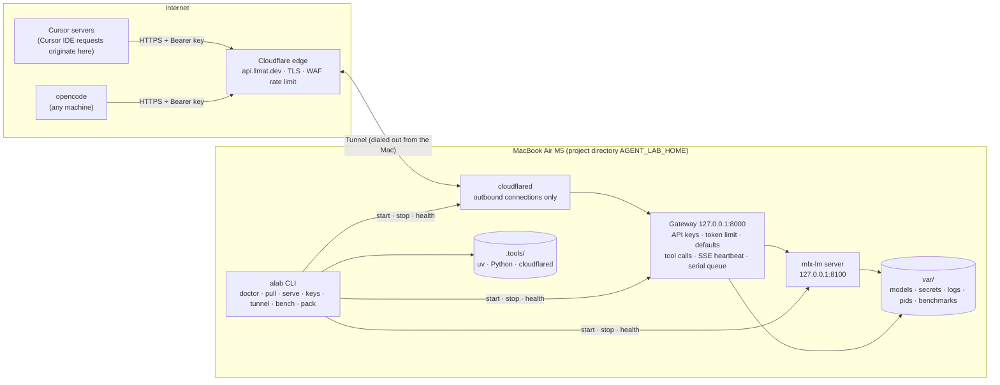

# Agent Lab Technical Design: Qwen3.8-27B on a MacBook Air M5 (24GB), Served Publicly at api.llmat.dev

- Status: reviewed, ready for implementation
- Date: 2026-10-04
- Revision history:
  - 2026-10-04 first version (PR #2), replacing the 2026-07-18 design.
  - 2026-10-04 revision: drop Ollama and use mlx-lm only; add public access at `api.llmat.dev` for Cursor and opencode; translate all docs to English.
- Task breakdown: see [`docs/tasks/README.md`](tasks/README.md)

## 0. Summary of decisions

| Question | Decision |
| --- | --- |
| Model | `Qwen/Qwen3.8-27B` (27B dense, hybrid attention, Apache 2.0, released 2026-08) |
| Quantization | **4-bit (Q4)**. 3-bit is only a fallback if memory turns out to be too tight |
| Runtime | **mlx-lm only**. Ollama, LM Studio and llama.cpp are out of scope |
| Maturity | mlx-lm 0.32.0 runs this model text-only. Its tool-parser auto-detection is unreliable for non-Coder Qwen models after 3.5, so the backend forces the `qwen3_coder` parser; with that, all 9 tool-call checks passed on the target machine, streaming and non-streaming (section 7.4, T04) |
| Context | **32K by default**, provided the prompt cache does not keep a second copy of the KV cache (section 4.2, measured in T06); otherwise 24K. 64K is not offered |
| Thinking mode | **Off by default**, can be enabled per request. At about 6–9 tok/s on this machine, the model's default `xhigh` thinking is unusable |
| Public access | **`https://api.llmat.dev/v1`**, exposed through Cloudflare Tunnel (the domain's DNS is already on Cloudflare). No inbound ports are opened on the Mac |
| Authentication | Every request needs a Bearer API key, including requests from the Mac itself. One key per client, each revocable on its own |
| Clients | **Cursor** (requires the Pro plan; its requests come from Cursor's servers, so the endpoint must be public) and **opencode** |
| Alternatives | Gemma 4 26B-A4B (MoE, roughly 3–5x faster, clearly weaker) as an optional "fast" profile. No other model in this class fits 24GB well |
| Isolation and packaging | Toolchain, Python, dependencies, model weights, cloudflared and secrets all live inside the project directory. No Homebrew, no global Python changes, no system services. Can be packed into an offline bundle for another Mac |
| Only system-level change | Temporarily raising the GPU wired memory limit (`sysctl iogpu.wired_limit_mb`). Requires explicit confirmation and resets on reboot |

Numbers in this document carry one of three labels: **[measured/official]** comes from the model card or third-party measurements, **[estimate]** is derived from the architecture, and **[to verify]** must be measured on the target machine (mostly in the T06 benchmark task).

## 1. Goals and non-goals

### Goals

1. Run Qwen3.8-27B reliably on a MacBook Air M5 with 24GB of unified memory.
2. Serve an OpenAI-compatible API at `https://api.llmat.dev/v1` that both Cursor and opencode can use, including their agent (tool-calling) features.
3. Stay fully self-contained: do not disturb any existing Python, Homebrew, Ollama or other setup on the machine. Deleting the project directory uninstalls everything.
4. Be packable and portable: the same configuration can be packed into an offline bundle and deployed to another Apple Silicon Mac without network access. Moving the public endpoint to another machine only needs a new tunnel token.
5. Keep memory predictable: no request may push the machine into heavy swapping or a freeze.
6. Be safe to expose publicly: requests without a valid key never reach the inference server, and a leaked key can be revoked quickly.
7. Have reproducible benchmarks, so the context size is decided by data.

### Non-goals (not in v1)

- A web chat UI, RAG, web search, or keeping several models loaded at once.
- Image and video input. The vision tower costs about 0.9GB more, which comes straight out of the context budget on 24GB. It can be added later through mlx-vlm, with its own design.
- An Ollama backend (dropped on 2026-10-04).
- Port forwarding, opening inbound ports, or running our own reverse proxy server. Public traffic only goes through Cloudflare Tunnel.
- Multi-user billing or quotas. v1 has a simple "one key per client" model.
- Cursor Tab completion. Cursor's Tab completion does not use custom models [measured/official], so this setup cannot replace it.
- Docker. Docker on macOS cannot use the Metal GPU.
- Linux/NVIDIA deployment (the interfaces leave room for it; section 8.4).

## 2. Hardware constraints

| Item | Value | Source |
| --- | --- | --- |
| Unified memory | 24GB | User's machine |
| Memory bandwidth | About 142 GB/s (STREAM), about 26% higher than M4 | [measured/official] MindStudio |
| Cooling | Fanless; about 6% throttling under sustained load | [measured/official] MindStudio |
| Default GPU memory limit | 18186MB (about 17.8GB, 74% of 24GB): Metal's `recommendedMaxWorkingSetSize` with `iogpu.wired_limit_mb=0` | [measured] T03 device test on the M5, 2026-10-05 |
| Sleep | The Mac sleeps when the lid is closed or when idle, and the public service is down while it sleeps | Section 7.5 |

Two direct consequences:

- **Decoding is bandwidth-bound.** Every generated token reads all ~15GB of 4-bit weights, so the theoretical ceiling is about 142 / 15 ≈ 9.5 tok/s. Expect **6–9 tok/s** in practice [estimate].
- **The default GPU memory limit is too small.** The 4-bit weights alone are about 15GB, close to the default limit, so the limit must be raised temporarily (section 4.3).

## 3. Model and quantization

### 3.1 Qwen3.8-27B key facts [measured/official]

| Item | Value |
| --- | --- |
| Parameters | 27B, dense |
| Layout | 64 layers: 16 × (3 × Gated DeltaNet linear attention + 1 × Gated Attention) |
| Full-attention layers | 16 layers, 24 Q heads, **4 KV heads**, head dim 256 |
| Native context | 262,144; about 1M with YaRN |
| Modalities | Text, image, video |
| Thinking mode | On by default; `reasoning_effort` can be xhigh / medium / low |
| Recommended sampling | Thinking: T=1.0, top_p=0.95, top_k=20. Non-thinking: T=0.7, top_p=0.8, top_k=20 |
| Agent ability | SWE-bench Pro 61.7%, OSWorld-Verified 84.3%. In a same-hardware test, all 90 single-step tool calls were valid, and 28 of 30 multi-step tool calls |
| License | Apache 2.0 |

The hybrid attention is what makes a usable context possible on 24GB: only the 16 full-attention layers need a KV cache, while the 48 linear-attention layers keep a fixed-size state.

### 3.2 Q4 or Q3

Community GGUF quantizations compared against BF16 [measured/official, summarized by kingy.ai]:

| Quantization | File size | KL divergence | Top-1 agreement |
| --- | --- | --- | --- |
| Q3 (IQ3_S) | 13.8GB | 0.0325 | 92.4% |
| Q4 (Q4_K_M / UD-Q4_K_XL) | 16.8–17.9GB | 0.0096–0.0113 | 95.5–96.0% |
| Q5 (UD-Q5_K_XL) | 20.2GB | 0.0044 | 97.3% |

MLX format [measured/official]: `mlx-community/Qwen3.8-27B-4bit` is 16.1GB in total, including a bf16 vision tower of about 0.9GB. Loaded text-only by mlx-lm, the weights are about **15.0GB**. We found no official or mlx-community 3-bit MLX build of Qwen3.8-27B; one can be made with `mlx_lm.convert` if needed.

**Decision: use Q4.**

- Q3's KL divergence is about 3x Q4's, and top-1 agreement is 3–4 points lower. Third parties describe it as "constrained but usable, with visible quality loss". For agent use, a malformed tool call is expensive, so trading quality for memory is not worth it.
- Q3 only saves about 3GB, which is roughly 45K more tokens of KV cache (using the numbers in section 4).
- Not Q5/Q6: Q5 is about 20GB and leaves almost no room for context on 24GB.
- Q3 stays as a fallback: if T06 shows that Q4 is still under too much memory pressure at 24K, evaluate a self-converted 3-bit or mixed 3/4-bit build.

### 3.3 Runtime: mlx-lm only

| Runtime | Support | Decision |
| --- | --- | --- |
| **mlx-lm** | Text-only Qwen3.5 support since v0.30.7. Qwen3.8-27B has the same layer layout as Qwen3.5/3.6-27B, and the mlx-community 4-bit build has about 177K downloads per month [measured/official]. The build's `config.json` declares `model_type = "qwen3_5"` (text config `qwen3_5_text`), which mlx-lm's `qwen3_5` module loads; its `sanitize()` drops the vision tower. **Pinned to mlx-lm 0.32.0** [measured in T04] | **Use** |
| Ollama | Supported since v0.32.12; `qwen3.8:27b-mlx` is 18GB including vision [measured/official] | Not used (decided 2026-10-04) |
| LM Studio | MLX and GGUF builds available | Not used: a GUI app, hard to keep self-contained and packable |
| llama.cpp | GGUF builds available | Not used |

Why mlx-lm: text-only loading takes about 15GB, about 3GB less than Ollama's 18GB, which is roughly 45K tokens of KV cache. It is a single pinned Python package, so it is the easiest to keep self-contained and to pack. Sampling defaults, chat template arguments, prefill chunking and the prompt cache size can all be set on the command line.

**Known gaps in mlx-lm, and how this design covers them:**

| Gap | Mitigation |
| --- | --- |
| `mlx_lm.server` has no hard context limit; the KV cache grows with the request. mlx-lm 0.32.0 added `--kv-bits` (KV cache quantization, which turns off batching); not used yet, evaluated in T06 [measured in T04] | The gateway enforces a token limit (section 6.3); backend concurrency is 1 |
| Default concurrency is 32, which multiplies KV memory | `--decode-concurrency 1` and `--prompt-concurrency 1`; the gateway handles queuing |
| Running out of memory can cause a kernel panic instead of an error: a user running a hybrid-attention model on an M4 Max hit an `IOGPUMemory.cpp` panic when the KV cache grew without bound [measured/official] | `mx.set_memory_limit()` turned out to be only a soft limit in MLX 0.32: above it, evaluation waits for queued work and then allocates anyway, and nothing raises until Metal refuses an allocation [measured in T04, from the MLX source]. So the launch wrapper sets it (it also keeps MLX's buffer cache below it) and runs a watchdog that reads MLX's active memory every 10 ms; above `metal_memory_limit` it logs the reason and exits the process, which returns all its GPU memory at once. It reacts after the fact, so one evaluation step (at most one prefill chunk) can overshoot the limit before it fires; the gateway's token limit is the primary guard and the watchdog the second layer |
| For non-Coder Qwen3.5/3.6 models, the server's tool-parser auto-detection fails: requests with tools come back with empty content [measured/official, mlx-lm issue #1293] | The launch wrapper forces the `qwen3_coder` parser (section 7.4); verified reliable in T04 |

### 3.4 Other models in the same class

| Model | Type | 4-bit size | Compared with Qwen3.8-27B | Verdict on 24GB |
| --- | --- | --- | --- | --- |
| **Gemma 4 26B-A4B** | MoE, about 4B active | About 15GB | HLE 17.2% vs 30.8%, clearly weaker; but it only reads about 4B parameters per token, so decoding should be 3–5x faster [estimate] | **Candidate "fast" profile**, evaluated in T10 |
| Gemma 4 31B | Dense | About 17.1GiB (Q4_K_M) | Coding 6/12 vs 12/12 in a same-hardware test; needs a Q8 KV cache to fit 64K | Not chosen: bigger, slower, weaker |
| Qwen3.6-27B | Dense, same architecture | About 15.7GiB | Identical memory curve, but coding 8/12 and document QA 8/24, clearly behind | Not chosen: superseded by 3.8 |
| Qwen3.6-35B-A3B | MoE, about 3B active | About 20GB [estimate] | Fast | Not chosen: at 4-bit it leaves almost no room for context on 24GB |
| Other Qwen3.8 sizes | Flash-Next (180B-A6B), 2.4T-A95B | Far beyond 24GB | — | Not feasible. 27B is the only Qwen3.8 model that runs on a single consumer machine |

The same-hardware comparisons come from kingy.ai's tests on an RTX 4090 24GB [measured/official], which concluded that "Qwen3.8-27B is the best default" for general local use. At 24GB, **no model that is stronger than Qwen3.8-27B also fits**.

## 4. Memory budget and context length

### 4.1 KV cache size [estimate, consistent with third-party data]

KV cache per token = 16 layers × 4 KV heads × 256 dims × 2 (K and V) × 2 bytes (fp16) = **65,536 bytes = 64KiB**.

The linear-attention layers keep a fixed-size state of roughly 48 layers × 48 heads × 128 × 128 × 4 bytes ≈ 0.15GB, independent of context length [estimate].

| Context | KV cache (fp16) |
| --- | --- |
| 8K | 0.5GiB |
| 24K | 1.5GiB |
| 32K | 2.0GiB |
| 64K | 4.0GiB |
| 128K | 8.0GiB |

### 4.2 Budget (Q4, text-only) [estimate, verified in T06]

Agents like Cursor and opencode resend the whole conversation on every turn. If the prompt cache cannot hold the current conversation, every turn has to prefill the full context again, which would be unusably slow on this machine (section 5). So the prompt cache must hold **at least one full-length conversation**, and that memory has to be in the budget.

The key unknown is whether mlx-lm, when reusing a cache entry, takes it out and extends it, or copies it first. The two cases give different budgets:

| Item | 32K, no copy | 32K, copied | 24K, copied |
| --- | --- | --- | --- |
| Weights | 15.0GB | 15.0GB | 15.0GB |
| KV cache of the current request | 2.1GB | 2.1GB | 1.6GB |
| Prompt cache (1 conversation) | Shared with the row above | 2.1GB | 1.6GB |
| Linear-layer state + activations + prefill chunk buffers + framework overhead | About 1.0–1.5GB | About 1.0–1.5GB | About 1.0–1.5GB |
| **Inference process total** | **About 18.1–18.6GB** | **About 20.2–20.7GB** | **About 19.2–19.7GB** |
| Left for macOS and other apps | About 5.5GB | About 3.5GB | About 4.5GB |

Third-party numbers from an RTX 4090 for reference: Q4_K_M (GGUF, 16GiB) peaked at 18.2GiB at 32K and 20.3GiB at 64K [measured/official].

**Decisions:**

- **Default profile: 32K**, with `prompt_cache_bytes` sized to hold one 32K conversation (about 2.1GB) and a single cache entry.
- **The first thing T06 measures is whether the cache is copied.** If it is, the default drops to **24K**. This barely affects opencode, which compacts the conversation according to its configured context. It matters more for Cursor; see section 7.4.
- **64K is not offered.** It would need a GPU limit of about 22GB and leave macOS only about 2GB. Wired memory cannot be swapped out, so the risk of freezing is too high. Reconsider only if mlx-lm ships KV cache quantization, or if a Q3 build passes the T06 measurements.
- 128K and above are not feasible on 24GB. Some write-ups estimate 64K–96K on 24GB machines; those numbers leave no headroom for macOS, and this design does not use them.

### 4.3 GPU memory limit

By default macOS only lets the GPU wire about 3/4 of unified memory. On the 24GB M5 that is 18186MB (about 17.8GB) [measured in T03], which cannot hold 15GB of weights plus a KV cache. Setting `iogpu.wired_limit_mb=20480` raised Metal's `recommendedMaxWorkingSetSize` to exactly 20.0GB, and setting it back to 0 restored 18186MB [measured in T03], so the sysctl is what MLX sees. The approach:

- Raise the limit temporarily with `sudo sysctl iogpu.wired_limit_mb=<value>`. **It resets to the default on reboot**, so nothing permanent is left behind.
- Recommended value: **20480MB (20GB)** [to verify, confirmed in T06]. A third party ran a 27B MLX model on a 24GB M4 with 21504MB [measured/official]; this design treats that as a hard ceiling and never exceeds it.
- Risk: wired memory cannot be swapped out, so setting it too high can make the system stall or freeze. The tool therefore only offers three explicit commands (show / apply / revert), asks for confirmation before every apply, and never installs a LaunchDaemon to apply it at boot.
- This is the **only** step in the design that needs sudo.

## 5. Thinking mode and expected performance

| Metric | Expectation | Basis |
| --- | --- | --- |
| Decoding | 6–9 tok/s | [estimate] 142GB/s bandwidth ÷ 15GB of weights |
| Prefill | Hundreds of tokens per second; the M5 GPU's built-in neural accelerators speed up the matrix math | [to verify] |
| First agent turn (about 10K tokens of system prompt and tool definitions) | Possibly 30 seconds to a minute | [estimate, to verify] |
| Later agent turns (prompt cache hit, only new content is prefilled) | A few hundred to a few thousand new tokens: several seconds to a dozen or so, plus generation time | [estimate, to verify] |
| A 32K prompt with no cache hit | Possibly 2–5 minutes | [estimate, to verify] |

Qwen3.8-27B thinks at `xhigh` effort by default. In Simon Willison's test, one task took 21 minutes with thinking on and 2 minutes with it off [measured/official, on an M5 Max with 128GB, much faster than this machine]. Therefore:

- The service turns **thinking off by default** (chat template argument `enable_thinking=false`).
- Clients can turn thinking on per request with `reasoning_effort`. mlx-lm has a known issue where changing chat template arguments per request bypasses the prompt cache [measured/official, mlx-lm issue #1803], so requests with thinking enabled lose their cache hits.
- When a client does not set sampling parameters, the gateway fills in the model card's recommended values for thinking or non-thinking mode.

**Honest expectations for day-to-day use:** a 27B model on this machine suits "hand it a task and come back in a few minutes", not interactive back-and-forth. An agent task in Cursor or opencode usually takes a dozen to several dozen tool-call turns, so a whole task can take ten minutes or more.

Optional speed-up (not in the v1 default path): the community has published `Qwen3.8-27B-MTP-4bit` (multi-token prediction), which gave about a 72% speed-up on other hardware [measured/official]. Whether mlx-lm can run MTP inference is [to verify], evaluated alongside T06.

## 6. Architecture


```mermaid
flowchart LR
    subgraph Remote["Internet"]
        CursorSrv["Cursor servers<br/>(Cursor IDE requests originate here)"]
        OpenCode["opencode<br/>(any machine)"]
        Edge["Cloudflare edge<br/>api.llmat.dev · TLS · WAF rate limit"]
    end

    subgraph Mac["MacBook Air M5 (project directory AGENT_LAB_HOME)"]
        CF["cloudflared<br/>outbound connections only"]
        GW["Gateway 127.0.0.1:8000<br/>API keys · token limit · defaults<br/>tool calls · SSE heartbeat · serial queue"]
        MLX["mlx-lm server<br/>127.0.0.1:8100"]
        CLI["alab CLI<br/>doctor · pull · serve · keys · tunnel · bench · pack"]
        Store[("var/<br/>models · secrets · logs · pids · benchmarks")]
        Tool[(".tools/<br/>uv · Python · cloudflared")]
    end

    CursorSrv -->|HTTPS + Bearer key| Edge
    OpenCode -->|HTTPS + Bearer key| Edge
    Edge <-->|"Tunnel (dialed out from the Mac)"| CF
    CF --> GW
    GW --> MLX
    CLI -->|"start · stop · health"| CF
    CLI -->|"start · stop · health"| GW
    CLI -->|"start · stop · health"| MLX
    MLX --> Store
    GW --> Store
    CLI --> Tool
```

opencode running on the Mac itself can also use `http://127.0.0.1:8000/v1` directly; it still needs an API key.

### 6.1 Components

| Component | Responsibility | Implementation |
| --- | --- | --- |
| `bootstrap.sh` | The single entry script: downloads pinned uv and cloudflared into `.tools/`, then uses uv to install a pinned Python and the dependencies inside the project | POSIX shell; verifies the sha256 of every download |
| `alab` CLI | Environment checks, model downloads, starting and stopping services, key management, tunnel control, benchmarks, packaging | Python package `agent_lab`, entry point `alab` |
| Gateway | The only externally reachable HTTP endpoint: authentication, token limit, default parameters, thinking switch, tool-call compatibility, SSE heartbeat, serial queue | Python ASGI app (Starlette, httpx, uvicorn), single process. Token counting reuses the `transformers` tokenizer that mlx-lm already depends on |
| Inference backend | Runs `mlx_lm.server` as a child process and sets the Metal memory limit before it starts | Pinned mlx-lm plus a thin launch wrapper |
| cloudflared | Carries `api.llmat.dev` traffic through Cloudflare Tunnel to the gateway | Pinned cloudflared binary, run as a child process managed by `alab`; never registered as a system service |

**Why a gateway is needed:**

1. mlx-lm has no context limit, so the gateway is the first line of defence against running out of memory.
2. Public exposure needs authentication, which mlx-lm's server does not have; its own docs say it is not meant for production exposure [measured/official].
3. Cloudflare drops a connection after about 100 seconds without data, and prefill on this machine can take longer, so the gateway has to send heartbeats (section 7.3).
4. The tool-call format clients expect may need converting from what the model actually emits (section 7.4).
5. A fixed port and model name mean client configuration does not change when the machine or the mlx-lm version changes.

The gateway is deliberately thin: no conversation storage, no multi-model routing, no billing.

### 6.2 Directory layout

```text
agent-lab/
├── bootstrap.sh              # single entry point: installs the toolchain
├── alab                      # wrapper script: loads .tools/env.sh, then runs the CLI
├── pyproject.toml / uv.lock  # pinned dependencies
├── config/
│   ├── models.toml           # model registry: repo, revision, sha256, size
│   ├── tools.toml            # versions and sha256 of uv and cloudflared
│   └── profiles/
│       ├── mac-24gb.toml     # default profile for this machine: 32K (or the value T06 settles on)
│       └── mac-32gb-plus.toml
├── src/agent_lab/            # CLI, gateway, backend launch wrapper
├── tests/
├── docs/
├── .tools/                   # not committed: uv, Python, cloudflared
└── var/                      # not committed: models/, logs/, run/, bench/, secrets/, cache/
```

All runtime paths derive from the `AGENT_LAB_HOME` environment variable, which defaults to the repository root. `var/secrets/` has mode 700 and the files in it have mode 600.

### 6.3 Gateway API contract

**Endpoints:**

- `POST /v1/chat/completions`: OpenAI-compatible, streaming and non-streaming, with `tools` / `tool_choice` / `tool_calls`. This is what Cursor and opencode use.
- `GET /v1/models`: returns `qwen3.8-27b`.
- `GET /healthz`: returns only `ok` or `unavailable`, with no version or configuration details. Detailed status is only available locally through `alab status`.
- No `/v1/completions`, embeddings, Responses API or other endpoints; those return 404.

**Model name:** always `qwen3.8-27b` externally. Cursor routes model names starting with `gpt-` or `claude-` to its own built-in providers [measured/official], and this name avoids that.

**Authentication:**

- Every request must carry `Authorization: Bearer <key>`, **including requests from 127.0.0.1**. cloudflared also connects to the gateway from the Mac itself, so exempting local requests would exempt all public requests too.
- Keys are created with `alab keys create <name>` (32 random bytes) and shown only once; `var/secrets/keys.toml` stores only their hashes. `alab keys list` and `alab keys revoke <name>` manage them.
- Keys are compared in constant time; failures return 401. **No IP-based bans**: Cursor's requests come from Cursor's shared server IPs, so banning by IP could block our own legitimate requests. Brute force is handled by the 32-byte random keys and Cloudflare rate limiting.

**Token limit:** the prompt is rendered with the model's tokenizer and chat template (including tool definitions) to count prompt tokens.

- If the prompt alone exceeds `max_context - min_output_tokens` (1024 reserved by default), return 400 with an OpenAI-style error: `{"error": {"code": "context_length_exceeded", ...}}`.
- Otherwise **clamp** `max_tokens` to `min(requested, max_output_tokens, max_context - prompt_tokens)` before forwarding, instead of rejecting. opencode always sends `max_tokens=32000` to custom providers [measured/official, opencode issue #20078], so rejecting would make every request fail.

**Parameters:**

- `reasoning_effort`: `none` (default) / `low` / `medium` / `high`, where `high` maps to the model's `xhigh`. Converted into mlx-lm `chat_template_kwargs` [exact argument names confirmed against the model's chat template in T05].
- When the client does not set sampling parameters, fill in the recommended values for thinking or non-thinking mode.

**Concurrency and heartbeats:**

- Only one request is forwarded at a time; the rest wait in a queue. The queue holds 4 by default; beyond that, return 429.
- Streaming requests: the gateway sends response headers immediately, then an SSE comment line (`: keep-alive`) every 15 seconds while the request is queued or prefilling, so Cloudflare's 100-second timeout never fires.
- Non-streaming requests: there is no way to keep the connection alive without committing to a status code early, so a non-streaming request that takes more than 100 seconds may be cut off by Cloudflare (524). Cursor and opencode both stream, so this only affects other tools; it goes in the user guide.
- When a client disconnects, cancel the backend request and free its queue slot.

**Logging:** only time, key name, prompt and output token counts, duration and status code. Request and response bodies are never logged.

### 6.4 Example profile

```toml
# config/profiles/mac-24gb.toml
[model]
id = "qwen3.8-27b-mlx-4bit"      # entry in config/models.toml

[backend]
port = 8100
prefill_step_size = 2048
prompt_cache_size = 1
prompt_cache_bytes = "2.2GB"      # enough for one full-length conversation
metal_memory_limit = "19.5GB"     # the launch wrapper stops the backend if MLX uses more (T04)
tool_parser = "qwen3_coder"       # forced: mlx-lm's auto-detection is unreliable for Qwen3.5+
enable_thinking = false           # chat template argument; thinking is off by default
temperature = 0.7                 # sampling defaults: the model card's non-thinking values
top_p = 0.8
top_k = 20
start_timeout_seconds = 600       # loading 15GB of weights from disk

[gateway]
port = 8000
max_context = 32768               # finalized in T06; 24576 if the cache is copied
max_output_tokens = 8192
min_output_tokens = 1024
queue_size = 4
heartbeat_seconds = 15

[tunnel]
enabled = true
hostname = "api.llmat.dev"

[system]
gpu_wired_limit_mb = 20480        # value used by `alab gpu-limit apply`
```

Sizes use binary units (1GB = 1024³ bytes). `alab` rejects unknown fields and checks cross-field rules (distinct ports, `min_output_tokens < max_context`, `metal_memory_limit` below `gpu_wired_limit_mb`, heartbeat under Cloudflare's 100 seconds). The tunnel token is never stored in the profile; it lives in `var/secrets/tunnel-token`. Field names are finalized in T01–T07; values follow the T06 results.

### 6.5 CLI commands

| Command | Purpose |
| --- | --- |
| `alab doctor` | Checks chip, memory, macOS version, disk space, GPU limit, port usage, toolchain integrity and tunnel setup |
| `alab pull [model]` / `alab models` | Download and verify a model / show model status |
| `alab gpu-limit show / apply / revert` | Show, temporarily raise, or restore the GPU memory limit |
| `alab keys create / list / revoke` | Manage API keys |
| `alab serve [--profile] [--no-tunnel]` | Start the backend, the gateway and (by default) the tunnel in order, and prevent idle sleep. Refuses to start if the GPU limit is too low or no key exists |
| `alab stop` / `alab status` | Stop everything / show status, memory, queue, tunnel connection and log locations |
| `alab tunnel set-token` / `alab tunnel check` | Save the tunnel token / check from the internet that `api.llmat.dev` is reachable |
| `alab bench` | Run benchmarks; results go to `var/bench/` |
| `alab pack` / `alab unpack` | Build an offline bundle / install it offline on a target machine |

## 7. Public access and clients

### 7.1 Why Cloudflare Tunnel

| Option | Decision |
| --- | --- |
| **Cloudflare Tunnel** | **Chosen.** `llmat.dev` DNS is already on Cloudflare (NS `alexa/carter.ns.cloudflare.com`, checked 2026-10-04). cloudflared only makes outbound connections, so no public IP, port forwarding or router changes are needed. Cloudflare manages TLS certificates. The free plan is enough |
| Router port forwarding + self-signed or Let's Encrypt certificate | Not chosen: exposes the home IP, depends on the network, breaks when the Mac moves |
| Tailscale Funnel | Not chosen: cannot use our own domain |
| ngrok and similar | Not chosen: custom domains are paid, and it adds another third party |
| Self-hosted VPS reverse proxy (frp, etc.) | Not chosen: one more server to maintain |

The public address is `https://api.llmat.dev/v1` (the subdomain can be changed in the profile).

### 7.2 Tunnel setup

Use a dashboard-managed tunnel (token based) rather than the locally managed kind created with `cloudflared tunnel login`, because the latter writes a certificate into `~/.cloudflared/`, which breaks isolation.

One-time manual steps (done once, documented in T07):

1. In the Cloudflare Zero Trust dashboard, create a tunnel named `agent-lab`.
2. Add a Public Hostname: `api.llmat.dev` → `http://127.0.0.1:8000`. Cloudflare creates the DNS record automatically.
3. Copy the tunnel token and run `alab tunnel set-token` on the Mac (reads from stdin, saves to `var/secrets/tunnel-token`).

From then on, `alab serve` runs `cloudflared tunnel run` as a child process, passing the token through the `TUNNEL_TOKEN` environment variable so it never appears in command-line arguments (where `ps` could show it). No `cloudflared service install` and no system services.

Moving to another machine: copy the project (or an offline bundle) and repeat step 3, or generate a new token for the same tunnel in the dashboard.

### 7.3 Cloudflare limits and settings

| Item | Details |
| --- | --- |
| 100-second timeout | Cloudflare returns 524 if no response headers arrive within about 100 seconds, and also drops a response after about 100 seconds without data. This cannot be changed on the Free, Pro or Business plans [measured/official]. The gateway's streaming heartbeat handles it (section 6.3) |
| Response buffering | SSE responses need `Content-Type: text/event-stream` and `Cache-Control: no-cache` to avoid buffering [confirmed in T07] |
| Rate limiting | Add one WAF rate-limiting rule for `api.llmat.dev` in the dashboard (the free plan includes one) to absorb floods of invalid requests. The threshold must be well above our own normal traffic (this machine handles a few requests per minute at most); the exact value is set in T07 |
| Caching | Bypass the cache for `api.llmat.dev` (Cache Rule: bypass) |
| Bot protection | Do not enable anything that shows a challenge page on this subdomain, or requests from Cursor's servers and from opencode will be blocked |

### 7.4 Clients

**Cursor** [measured/official, see references]:

- The "Override OpenAI Base URL" option requires the **Pro plan**.
- Requests come from Cursor's servers, not from the user's machine, so `localhost` does not work and the endpoint must be public HTTPS. This also means code and conversations pass through Cursor's servers.
- Setup: Settings → Models → enter the API key (from `alab keys create cursor`) → enable Override OpenAI Base URL with `https://api.llmat.dev/v1` → add the custom model name `qwen3.8-27b`.
- Streaming is required.
- Works with: Chat and Agent. Tab completion does not use custom models, and according to user reports, subagents also ignore custom models.
- **Known issue: Cursor assumes custom models have a 1M context, and there is no setting to change it** [measured/official, Cursor forum]. Cursor will therefore not compact the conversation before 32K, so long sessions will hit the gateway's limit and stall. The gateway returns the standard `context_length_exceeded` error; whether Cursor reacts by compacting is [to verify, T08]. If it does not, the user guide will recommend "one new chat per task".

**opencode** [measured/official, see references]:

- Add a provider of type `@ai-sdk/openai-compatible` to `opencode.json`:

```json
{
  "$schema": "https://opencode.ai/config.json",
  "provider": {
    "llmat": {
      "npm": "@ai-sdk/openai-compatible",
      "name": "llmat (Qwen3.8-27B)",
      "options": {
        "baseURL": "https://api.llmat.dev/v1",
        "apiKey": "{env:LLMAT_API_KEY}"
      },
      "models": {
        "qwen3.8-27b": {
          "name": "Qwen3.8 27B",
          "limit": { "context": 32768, "output": 8192 }
        }
      }
    }
  }
}
```

- `limit.context` must match the profile's `max_context`, so opencode compacts the conversation before reaching the limit. `limit.output` only takes effect when it is below 32000 [measured/official, opencode issue #20078].
- When opencode runs on the Mac itself, `baseURL` can be `http://127.0.0.1:8000/v1` to skip the round trip through Cloudflare.

**Tool calling (both clients' agent features depend on it):**

This is the biggest technical risk in the design. Qwen models from 3.5 onward emit tool calls in an XML-like format (`<tool_call><function=...><parameter=...>`, the format the `qwen3_coder` parser handles). mlx-lm's server fails to auto-detect this for non-Coder models, and requests with tools come back with empty content [measured/official, mlx-lm issue #1293]. The plan:

1. T04 checks first: force the `qwen3_coder` tool parser in the launch wrapper (through a CLI argument, or by setting `tool_parser_type` in the local model's `tokenizer_config.json`), and check that `tool_calls` come back correctly for both streaming and non-streaming requests.
2. If mlx-lm's parsing is unreliable in either case, T05 implements parsing in the gateway: the backend only generates text, and the gateway converts tool-call blocks in the model output into OpenAI `tool_calls` (incremental deltas when streaming), verified against a fixed set of test samples.

   **T04 result: mlx-lm's parsing is reliable, so the gateway passes tool calls through.** The launch wrapper passes `tool_parser_type = "qwen3_coder"` to the tokenizer (the model files stay untouched). On the MacBook Air M5 with the 27B model, all 9 checks in `tests/tool_call_check.py` passed: one call, two parallel calls, arguments with quotes, backslashes and newlines, and an answer from a tool result, each streaming and non-streaming, with no thinking content [measured in T04, report in `docs/results/t04-tool-call-check.md`]. When streaming, mlx-lm sends each tool call as one complete `delta.tool_calls` entry once the call is finished, not argument by argument.
3. T08 runs a set of real agent tasks in both Cursor and opencode as acceptance.

### 7.5 Availability

- The service is only up while the Mac is on, awake and running `alab serve`. While `alab serve` runs, `caffeinate -i` prevents idle sleep, but **closing the lid still puts the Mac to sleep** (unless it is on power with an external display).
- When the Mac is offline, Cloudflare returns an error directly (usually 502 or 530) and clients see a failed request.
- This is a personal laptop with no availability guarantee; the user guide says so.

## 8. Isolation and packaging

### 8.1 Rules for not disturbing the machine

| Rule | How |
| --- | --- |
| Never use the system or Homebrew Python | uv installs a pinned Python into `.tools/python` (via `UV_PYTHON_INSTALL_DIR`) |
| Never use global pip | Dependencies go into the project's `.venv`, pinned by `uv.lock` |
| Never write to user cache directories | `HF_HOME`, `UV_CACHE_DIR`, `XDG_CACHE_HOME` and `PYTHONPYCACHEPREFIX` all point under `var/` or `.tools/`; uv only uses its own managed Python (`UV_MANAGED_PYTHON=1`), installs no shims into `~/.local/bin`, and ignores the user's uv configuration (`UV_NO_CONFIG=1`, inherited `UV_*` variables cleared) |
| cloudflared never touches `~/.cloudflared` | Run with a token; never run `cloudflared tunnel login`; the binary lives in `.tools/` |
| Never interfere with an existing Ollama or other services | Only local ports 8000 and 8100 are used, and `doctor` checks them |
| Never register system services | No LaunchAgent / LaunchDaemon, no `cloudflared service install`. Services are started by `alab serve`, with pids in `var/run/` |
| Never edit shell configuration | `~/.zshrc` is untouched; use the `./alab` wrapper or `source .tools/env.sh` |
| The only system-level change | The GPU memory limit: temporary, explicitly confirmed, revertible (section 4.3) |
| Full uninstall | Restore the GPU limit (or reboot), delete the project directory, and delete the tunnel in the Cloudflare dashboard. T01's acceptance checks that nothing new appears under `$HOME` |

### 8.2 Version pinning

- uv and cloudflared: versions and sha256 in `config/tools.toml`, per platform. `darwin-arm64` is the target; a `linux-x86_64` entry exists only so the toolchain and unit tests can run on Linux development machines.
- Python: version in `.python-version`.
- Python dependencies: `uv.lock`.
- Models: `config/models.toml` records the Hugging Face repo, the **commit revision** and every file's sha256; each file is verified after download.

### 8.3 Offline bundle

`alab pack --profile mac-24gb` builds a tar archive (about 16–17GB):

```text
agent-lab-bundle-<version>-<profile>/
├── manifest.json        # version, git commit, profile, minimum macOS version, sha256 of every file
├── source/              # repository code (git archive)
├── tools/               # uv, Python distribution, cloudflared
├── wheels/              # macOS arm64 wheels for everything in uv.lock
└── models/              # model files the profile needs
```

**The bundle contains no secrets** (neither key hashes nor the tunnel token). On the target machine, `./unpack.sh` checks the chip and macOS version → verifies the manifest → extracts to the target directory → installs offline from the bundled wheels → runs `alab doctor`. Keys and the tunnel token are then created again on the target machine.

Limitation: MLX wheels only work on Apple Silicon and have a minimum macOS version. If the target does not meet them, `unpack.sh` stops before installing anything.

### 8.4 Deploying elsewhere

| Target | How |
| --- | --- |
| Another Apple Silicon Mac | An offline bundle, or clone and run `bootstrap.sh`. Pick the profile that matches its memory. After setting the tunnel token, `api.llmat.dev` points to the new machine |
| Linux + NVIDIA server | **Not in v1.** The gateway contract, authentication and tunnel do not depend on the backend, so a future backend pointing at vLLM or similar can be added without changing clients |

## 9. Security

| Threat | Mitigation |
| --- | --- |
| Unauthorized use (someone discovers `api.llmat.dev`) | Every request needs an API key; requests without one get 401 at the gateway and never reach the inference server |
| Brute-forcing keys | Keys are 32 random bytes, so guessing is computationally infeasible. A Cloudflare WAF rate limit absorbs floods (its threshold must sit well above our own traffic, since Cursor's requests share server IPs) |
| Leaked key | One key per client; `alab keys revoke` takes effect immediately; only hashes are stored |
| Resource exhaustion (huge requests, request floods) | Token limit, single concurrency, queue cap with 429, Metal memory limit |
| Local ports reachable from the LAN | The gateway and backend only listen on `127.0.0.1`; public traffic only arrives through the tunnel |
| Information leaks | `/healthz` exposes no versions or configuration; logs contain no bodies; secrets are never committed, never bundled and never passed as command-line arguments (the tunnel token goes to cloudflared through an environment variable so it does not show in `ps`) |
| Data privacy | With Cursor, code and conversations pass through Cursor's servers; that is how Cursor works and this design cannot change it. opencode involves no third party apart from Cloudflare terminating TLS |

Also:

- The inference server runs with `HF_HUB_OFFLINE=1` and `HF_HUB_DISABLE_TELEMETRY=1`; models are only downloaded by `alab pull`.
- Without the tunnel (`--no-tunnel`), the whole service can run with no network; T06 includes an offline check.

## 10. Testing and acceptance

| Level | What | Where |
| --- | --- | --- |
| Unit tests | Config parsing, authentication, token limit and `max_tokens` clamping, parameter conversion, tool-call parsing, heartbeats, path isolation | GitHub Actions macOS arm64 runner |
| Integration tests | A tiny MLX model through bootstrap → pull → serve → authenticated requests (streaming and tool calls) → stop | GitHub Actions macOS arm64 runner (about 7GB of memory, cannot run 27B) |
| Device tests | 27B on the real machine: context ladder, peak memory, swap, tok/s, thinking switch | The user's MacBook Air M5 |
| End-to-end tests | Real agent tasks from Cursor and opencode through `api.llmat.dev` | The user's Mac + Cursor + opencode |

Pass criteria for the device tests (T06): with the final profile, run a multi-turn conversation that fills `max_context` (simulating an agent, reusing the cache each turn) three times in a row. Peak memory of the inference process stays under the GPU limit, system swap grows by less than 1GB, and there are no errors.

## 11. Risks and open questions

| Risk / open question | Impact | Handling |
| --- | --- | --- |
| mlx-lm parses Qwen3.8 tool calls unreliably | Cursor and opencode agents do not work | Resolved in T04: the forced `qwen3_coder` parser passed every check; T08 still runs real agent tasks (section 7.4) |
| Minimum mlx-lm version for Qwen3.8 | T04 cannot start the model | Resolved in T04: `model_type` is `qwen3_5`, supported since v0.30.7; pinned to 0.32.0 |
| Reusing the prompt cache copies the KV cache | 32K does not fit | First measurement in T06; drop to 24K |
| Cursor assumes custom models have a 1M context | Long sessions stall in Cursor | T08 checks how Cursor handles `context_length_exceeded`; if it does not compact, the user guide recommends one new chat per task and opencode for long tasks |
| Agent use is slow overall | A single task can take ten minutes or more | Expectations set in section 5; evaluate MTP (T06) and the fast profile (T10) |
| Running out of memory causes a kernel panic | Reboot and possible data loss | Watchdog on MLX's memory (stops the backend above `metal_memory_limit`) plus the gateway's token limit |
| Cloudflare's 100-second timeout | Connections drop during long prefills | Streaming heartbeats; long non-streaming requests documented |
| The Mac sleeps or goes offline | Public service unavailable | `caffeinate`; availability documented |
| Fanless throttling | Slower long tasks | T06 records a 10-minute sustained-load speed curve |
| mlx-lm has no KV cache quantization yet | Cannot use an 8-bit KV cache to extend context | Keep the current profile; re-evaluate when mlx-lm ships it |
| Vision | Not in v1 | Add later through mlx-vlm with its own design |

## 12. References

Model and quantization:

- [Qwen/Qwen3.8-27B model card](https://huggingface.co/Qwen/Qwen3.8-27B)
- [mlx-community/Qwen3.8-27B-4bit](https://huggingface.co/mlx-community/Qwen3.8-27B-4bit)
- [Qwen3.8-27B on Apple Silicon: MLX Setup, VRAM & Reality](https://www.orcarouter.ai/blog/qwen-3-8-27b-mlx)
- [Run Qwen3.8-27B on Ollama](https://www.orcarouter.ai/blog/qwen-3-8-27b-ollama)
- [Best Qwen3.8-27B GGUF: Q2–Q8 quality comparison](https://kingy.ai/blog/qwen3-8-27b-best-quantization-gguf/)
- [Qwen3.8 vs Qwen3.6 vs Gemma 4: 24GB GPU Test](https://kingy.ai/blog/qwen3-8-27b-vs-qwen3-6-27b-vs-gemma-4-31b/)
- [Gemma 4 26B-A4B vs Qwen3.8-27B](https://benchlm.ai/compare/gemma-4-26b-a4b-vs-qwen3-8-27b)
- [Qwen 3.8 27B defaults to overthinking (Simon Willison)](https://simonwillison.net/2026/Aug/16/qwen-38-27b/)
- [Qwen 3.8 model lineup](https://codersera.com/blog/qwen-3-8-model-lineup-2026/)

Hardware and mlx-lm:

- [M5 MacBook Air local AI performance](https://www.mindstudio.ai/blog/m5-macbook-air-local-ai-performance)
- [iogpu.wired_limit_mb explained](https://modelpiper.com/blog/iogpu-wired-limit-mb-mac)
- [mlx-lm HTTP server options](https://deepwiki.com/ml-explore/mlx-lm/3.3-http-server)
- [mlx-lm issue #1308: KV quantization and thinking options in the server](https://github.com/ml-explore/mlx-lm/issues/1308)
- [mlx-lm issue #1803: per-request chat_template_kwargs bypass the prompt cache](https://github.com/ml-explore/mlx-lm/issues/1803)
- [mlx-lm issue #1293: tool-call parsing for non-Coder Qwen 3.5/3.6 models](https://github.com/ml-explore/mlx-lm/issues/1293)
- [How my local coding agent crashed my Mac: MLX memory management](https://medium.com/@michael.hannecke/how-my-local-coding-agent-crashed-my-mac-and-what-i-learned-about-mlx-memory-management-e0cbad01553c)

Public access and clients:

- [Cloudflare error 524](https://developers.cloudflare.com/support/troubleshooting/http-status-codes/cloudflare-5xx-errors/error-524)
- [WebSockets and SSE through Cloudflare: the 100-second rule](https://stackharbor.com/en/knowledge-base/cffix-websockets-sse-behind-cloudflare/)
- [Why localhost doesn't work as OpenAI Base URL in Cursor](https://dev.to/orchidfiles/why-localhost-doesnt-work-as-openai-base-url-in-cursor-and-how-to-fix-it-589e)
- [Override OpenAI Base URL in Cursor: configuration guide](https://www.coderouter.io/blog/override-openai-base-url-cursor-configuration-guide)
- [cursor-custom-provider: Cursor's private-network and model-name restrictions](https://github.com/xFurti/cursor-custom-provider)
- [Cursor forum: custom models set the context window to 1M](https://forum.cursor.com/t/custom-models-set-the-context-window-to-1m/160106)
- [opencode providers documentation](https://opencode.ai/docs/providers/)
- [opencode issue #20078: custom providers always send max_tokens=32000](https://github.com/anomalyco/opencode/issues/20078)
