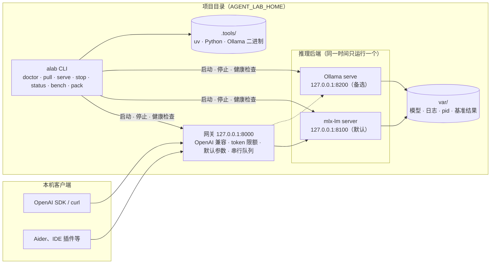

# Agent Lab 技术设计：在 MacBook Air M5（24GB）上本地部署 Qwen3.8-27B

- 状态：已评审，待实现
- 日期：2026-10-04
- 取代：2026-07-18 的旧版 `docs/design.md`（基于 MLX-VLM + Open WebUI 的多模型方案，已整体废弃）
- 任务拆分：见 [`docs/tasks/README.md`](tasks/README.md)

## 0. 结论摘要

| 问题 | 结论 |
| --- | --- |
| 模型 | `Qwen/Qwen3.8-27B`（27B dense，混合注意力，Apache 2.0，2026-08 发布） |
| 量化 | **4-bit（Q4）为默认**。3-bit 只作为内存吃紧时的后备，不作为默认 |
| 运行时 | **mlx-lm 为默认后端**，Ollama（MLX 引擎）为受支持的备选后端，两者都在本方案中实现 |
| 成熟度 | 两条路径都已正式支持该模型，但模型发布仅约 7 周，属于"可用、但需要实测确认"的阶段 |
| Context | **默认 32K**。64K 在 fp16 KV 下会把 macOS 挤到只剩约 2GB，不作为可用档位，只有在 8-bit KV 或 Q3 可用且实测通过后才考虑；262K 原生上限在 24GB 上不可行 |
| 思考模式 | 默认**关闭**，可按请求打开。模型默认 `xhigh` 思考，在本机约 6–9 tok/s 的速度下不可接受 |
| 同级替代 | Gemma 4 26B-A4B（MoE，速度快约 3–5 倍，能力明显弱）作为"快速档"候选；其余同级模型在 24GB 上不合适 |
| 隔离与打包 | 所有文件都在一个目录内（工具链、Python、依赖、模型、日志），不装 Homebrew、不改全局 Python、不注册后台服务；支持打成离线包部署到其他 Mac |
| 唯一的系统级改动 | 临时提高 GPU 可用内存上限（`sysctl iogpu.wired_limit_mb`），需显式确认，重启自动恢复 |

本文中的数字分三类，并逐一标注：**[实测/官方]** 来自模型卡或第三方实测，**[估算]** 是根据架构参数推算的，**[待验证]** 必须在 T06 基准测试任务中在目标机器上实测确认。

## 1. 目标与非目标

### 目标

1. 在一台 MacBook Air M5、24GB 统一内存的机器上，稳定运行 Qwen3.8-27B，对本机程序提供 OpenAI 兼容的 HTTP 接口。
2. 环境完全自包含：不破坏本机已有的 Python、Homebrew、Ollama 等任何环境，删除项目目录即可完全卸载。
3. 可打包、可迁移：同一套配置能一键打成离线包，在另一台 Apple Silicon Mac 上无需联网即可部署；接口契约不依赖具体后端，将来迁到 Linux/NVIDIA 服务器只需换后端。
4. 内存可预测：任何请求都不能把机器拖进大量 swap 或卡死。
5. 有可复现的基准测试，用数据决定 context 档位和默认后端。

### 非目标（v1 不做）

- 网页聊天界面、RAG、联网搜索、多模型同时常驻（旧设计里的 Open WebUI、supervisor 动态切换模型等全部移除）。
- 图像/视频输入。模型本身支持视觉，但视觉塔会额外占用约 0.9GB，在 24GB 上会直接挤占 context。v1 只做文本；Ollama 后端天然带视觉，可作为将来的入口（见第 10 节）。
- Docker。macOS 上的 Docker 运行在 Linux 虚拟机里，无法使用 Metal GPU，不能用于本机推理。
- 对外网提供服务。默认只监听 `127.0.0.1`。

## 2. 硬件约束

| 项目 | 数值 | 来源 |
| --- | --- | --- |
| 统一内存 | 24GB | 用户机器 |
| 内存带宽 | 约 142 GB/s（STREAM 实测），比 M4 高约 26% | [实测/官方] MindStudio |
| 散热 | 无风扇，持续负载下有约 6% 的降频 | [实测/官方] MindStudio |
| GPU 默认可用内存 | 由内核按物理内存推导，24GB 机型约 16–18GB | [实测/官方]，具体值以 `doctor` 读到的数为准 [待验证] |

两个直接后果：

- **解码速度受带宽限制。** 每生成一个 token 要把约 15GB 的 4-bit 权重读一遍，理论上限约 142 / 15 ≈ 9.5 tok/s，实际预计 **6–9 tok/s** [估算]。这决定了思考模式必须默认关闭（第 5 节）。
- **默认 GPU 内存上限装不下。** 4-bit 权重约 15–16GB，已接近或超过默认上限，必须临时提高上限（第 4.3 节）。

## 3. 模型与量化选型

### 3.1 Qwen3.8-27B 关键参数 [实测/官方]

| 项目 | 数值 |
| --- | --- |
| 参数量 | 27B，dense |
| 层结构 | 64 层：16 组 ×（3 层 Gated DeltaNet 线性注意力 + 1 层 Gated Attention） |
| 全注意力层 | 16 层，24 个 Q 头，**4 个 KV 头**，head dim 256 |
| 原生 context | 262,144；YaRN 可扩展到约 1M |
| 模态 | 文本、图像、视频 |
| 思考模式 | 默认开启，`reasoning_effort` 可选 xhigh / medium / low |
| 推荐采样 | 思考：T=1.0, top_p=0.95, top_k=20；非思考：T=0.7, top_p=0.8, top_k=20 |
| 许可证 | Apache 2.0 |

混合注意力是这个模型能在 24GB 上开到可用 context 的关键：只有 16 层全注意力层需要 KV cache，48 层线性注意力层只保存固定大小的状态。

### 3.2 Q4 还是 Q3

GGUF 社区量化与 BF16 的对比 [实测/官方，kingy.ai 汇总]：

| 量化 | 文件大小 | KL 散度 | Top-1 一致率 |
| --- | --- | --- | --- |
| Q3（IQ3_S） | 13.8GB | 0.0325 | 92.4% |
| Q4（Q4_K_M / UD-Q4_K_XL） | 16.8–17.9GB | 0.0096–0.0113 | 95.5–96.0% |
| Q5（UD-Q5_K_XL） | 20.2GB | 0.0044 | 97.3% |

MLX 格式 [实测/官方]：`mlx-community/Qwen3.8-27B-4bit` 共 16.1GB（含 bf16 视觉塔约 0.9GB），mlx-lm 以纯文本方式加载时权重约 **15.0GB**。目前没有找到官方或 mlx-community 发布的 Qwen3.8-27B 3-bit MLX 版本，需要时可用 `mlx_lm.convert` 自行转换。

**结论：默认使用 Q4。**

- Q3 的 KL 散度约是 Q4 的 3 倍，Top-1 一致率低约 3–4 个百分点，第三方评价是"受限但可用、质量损失可见"。
- Q3 只能省出约 3GB，按第 4 节的算法，相当于多出约 45K token 的 KV 空间。但 Q4 已经能开到 32K，对大多数用途足够，用质量换这部分 context 不划算。
- 不选 Q5/Q6：Q5 约 20GB，在 24GB 机器上几乎不剩 context 空间。
- Q3 保留为后备：如果 T06 实测发现 Q4 在 32K 下内存压力过大，再评估自转换的 3-bit 或 3/4 混合精度版本。

### 3.3 运行时支持与成熟度

| 运行时 | 支持情况 | 成熟度判断 |
| --- | --- | --- |
| **mlx-lm** | 自 v0.30.7 起支持 Qwen3.5 系列纯文本推理；Qwen3.8-27B 与 Qwen3.5/3.6-27B 层结构相同，mlx-community 的 4-bit 版本月下载量约 17.7 万 [实测/官方] | 可用。Qwen3.8 是否沿用同一 `model_type`、需要的最低 mlx-lm 版本 [待验证]，在 T04 中锁定版本 |
| **Ollama** | v0.32.12 起正式支持；提供 `qwen3.8:27b-mlx`（MLX 引擎，18GB，含视觉）和 `qwen3.8:27b`（q4_K_M GGUF，18GB）[实测/官方] | 可用。视觉解析器发布初期有过 bug 并已修复；OpenAI 兼容接口会忽略请求里的 context 长度，必须在 Modelfile 里写死 `num_ctx` |
| LM Studio | 有 MLX 和 GGUF 版本 | 不采用：GUI 应用，难以自包含和打包 |
| llama.cpp | 有 GGUF 版本 | 不单独采用：Ollama 已覆盖 GGUF 路径 |

**为什么默认选 mlx-lm：**

1. **内存占用最小。** 纯文本加载约 15GB，Ollama 两个 tag 都是 18GB（含视觉塔）。在 24GB 机器上，这 3GB 差距约等于 45K token 的 KV cache。
2. **最容易自包含。** 就是一个锁定版本的 Python 包，用 uv 装在项目目录里，打包也最直接。
3. **可控性好。** 采样参数、chat template 参数（关闭思考）、prefill 分块、prompt cache 上限都能在启动参数里设定。

**mlx-lm 的两个短板，以及本设计如何补上：**

- `mlx_lm.server` **没有硬性的 context 上限**，KV cache 随请求长度增长；已发布版本也没有 `--kv-bits`（KV 量化）参数（相关 PR 进行中）[实测/官方]。一个超长请求就可能把机器推进 swap。补救：所有请求经过本项目的网关（第 6.3 节），网关先算 token 数，超出档位直接拒绝；同时把 `--decode-concurrency` 和 `--prompt-concurrency` 设为 1。
- 默认并发是 32，会让 KV 按并发数放大。补救同上。

**为什么同时实现 Ollama：** 它通过 `num_ctx` 预分配 KV cache，内存是硬上限，行为更可预测；它自带视觉；它是对比测试的对照组。如果 T07 的对比测试显示 Ollama 在速度和稳定性上明显更好，就把默认后端切换过去，网关接口不变。

### 3.4 同级别的其他模型

| 模型 | 类型 | 4-bit 大小 | 与 Qwen3.8-27B 对比 | 在 24GB 上的结论 |
| --- | --- | --- | --- | --- |
| **Gemma 4 26B-A4B** | MoE，激活约 4B | 约 15GB | HLE 17.2% 对 30.8%，能力明显弱；但每 token 只读约 4B 参数，解码预计快 3–5 倍 [估算] | **作为"快速档"候选**，在 T09 评估 |
| Gemma 4 31B | dense | 约 17.1GiB（Q4_K_M） | 同机测试中编程 6/12 对 12/12；64K 需要 Q8 KV 才能放下 | 不选：更大、更慢、更弱 |
| Qwen3.6-27B | dense，同架构 | 约 15.7GiB | 内存曲线完全相同，但编程 8/12、文档问答 8/24，明显落后 | 不选：被 3.8 全面替代 |
| Qwen3.6-35B-A3B | MoE，激活约 3B | 约 20GB [估算] | 速度快 | 不选：4-bit 在 24GB 上几乎没有 context 空间 |
| Qwen3.8 其他尺寸 | Flash-Next（180B-A6B）、2.4T-A95B | 远超 24GB | — | 不可行。Qwen3.8 系列中只有 27B 能在单机消费级硬件上运行 |

同机对比数据来自 kingy.ai 在 RTX 4090 24GB 上的测试 [实测/官方]，结论是"Qwen3.8-27B 是本地综合用途的最佳默认选择"。在 24GB 档位，**没有比 Qwen3.8-27B 更强、又能放得下的模型**；唯一值得保留的替代是用能力换速度的 Gemma 4 26B-A4B。

## 4. 内存预算与 context 长度

### 4.1 KV cache 大小 [估算，与第三方数据一致]

每个 token 的 KV cache = 16 层 × 4 个 KV 头 × 256 维 × 2（K 和 V）× 2 字节（fp16）= **65,536 字节 = 64KiB**。

线性注意力层的状态是固定大小，约 48 层 × 48 头 × 128 × 128 × 4 字节 ≈ 0.15GB，与 context 长度无关 [估算]。

| Context | KV cache（fp16） | KV cache（8-bit，若可用） |
| --- | --- | --- |
| 8K | 0.5GiB | 0.25GiB |
| 32K | 2.0GiB | 1.0GiB |
| 64K | 4.0GiB | 2.0GiB |
| 128K | 8.0GiB | 4.0GiB |
| 262K | 16.0GiB | 8.0GiB |

### 4.2 预算表（mlx-lm 后端，Q4，纯文本）[估算，T06 验证]

| 项目 | 32K 档（默认） | 64K（仅作对照） |
| --- | --- | --- |
| 权重 | 15.0GB | 15.0GB |
| 当前请求的 KV cache（fp16） | 2.1GB | 4.3GB |
| prompt cache 中保留的其他会话（上限可配，默认 0.5GB） | 0.5GB | 0.5GB |
| 线性层状态 + 激活 + prefill 分块缓冲 + 框架开销 | 约 1.0–1.5GB | 约 1.0–1.5GB |
| **推理进程合计** | **约 18.6–19.1GB** | **约 20.8–21.3GB** |
| 留给 macOS 和其他应用 | 约 5GB | 约 2.7–3.2GB |

第三方在 RTX 4090 上的实测与此吻合：Q4_K_M（GGUF，16GiB）在 32K 时峰值 18.2GiB，64K 时 20.3GiB [实测/官方]。

**结论：**

- **默认 32K。** 推理进程约 19GB，macOS 还剩约 5GB，可以同时开浏览器和编辑器，但不适合再开其他大内存应用。
- **64K 在 fp16 KV 下不作为可用档位。** 它要求把 GPU 上限提到 22GB 左右，macOS 只剩 2GB 多，而 wired 内存无法换出，系统卡死的风险过高。只有在下面两个条件之一满足、且 T06 实测达标后，才新增 64K 档：
  - 后端支持 8-bit KV cache（mlx-lm 尚未发布该参数；Ollama 的 GGUF 路径有 `OLLAMA_KV_CACHE_TYPE=q8_0`，MLX 引擎下是否生效 [待验证]）；
  - 改用 Q3 权重（省约 3GB）。
- 128K 及以上在 24GB 上不可行。
- 有人估算 24GB 机器能开 64K–96K，那是没有给 macOS 留余量的算法，本设计不采用。
- Ollama 后端多出约 3GB（视觉塔和 GGUF 开销），同样的预算下默认档降为 **16K** [估算]。

### 4.3 GPU 内存上限

macOS 默认只允许 GPU 锁定约 2/3 到 3/4 的统一内存。24GB 机器的默认值约 16–18GB，装不下 15GB 权重加 KV cache。做法：

- 使用 `sudo sysctl iogpu.wired_limit_mb=<值>` 临时提高上限。**重启后自动恢复默认值**，不留下永久改动。
- 推荐值：32K 档 **20480MB（20GB）** [待验证，T06 确认]，即推理进程约 19GB 再留约 1GB 余量。第三方在 24GB M4 上使用 21504MB 跑通了 27B MLX 模型 [实测/官方]，可作为上限参考，本设计不超过这个值。
- 风险：wired 内存无法被换出，设得过高会让系统卡顿甚至死机。因此工具只提供"应用/查看/恢复"三个显式命令，每次应用前都要求确认，并且不安装开机自启的 LaunchDaemon。
- 这是本方案**唯一**需要 sudo 的操作。

## 5. 思考模式与性能预期

| 指标 | 预期 | 依据 |
| --- | --- | --- |
| 解码 | 6–9 tok/s | [估算] 带宽 142GB/s ÷ 权重 15GB |
| Prefill | 每秒数百 token 量级；M5 GPU 内置神经加速器对矩阵运算有加速 | [待验证] |
| 32K 长提示首 token 延迟 | 可能需要 2–5 分钟；多轮对话依赖 prompt cache 避免重复 prefill | [估算，待验证] |

Qwen3.8-27B 默认以 `xhigh` 强度思考。Simon Willison 的测试中，同一个任务开思考要 21 分钟，关掉只要 2 分钟 [实测/官方，M5 Max 128GB，比本机快得多]。在 6–9 tok/s 下，默认思考会让普通问题等上几分钟。因此：

- 服务默认**关闭思考**（通过 chat template 参数 `enable_thinking=false`）。
- 客户端可在单个请求里打开思考，网关负责把参数转成各后端的格式。由于 mlx-lm 已知"单请求修改 chat template 参数会绕过 prompt cache"的问题 [实测/官方，mlx-lm issue #1803]，开思考的请求会损失缓存命中，这是可以接受的代价。
- 采样参数按模型卡推荐值分两套（思考/非思考），由网关在请求未指定时补上。

可选加速（不进 v1 默认路径）：社区已有 `Qwen3.8-27B-MTP-4bit`（多 token 预测），在其他机器上有约 72% 的提速 [实测/官方]。mlx-lm 是否支持 MTP 推理 [待验证]，在 T06 中顺带评估。

## 6. 总体架构


```mermaid
flowchart LR
    subgraph Clients["本机客户端"]
        SDK["OpenAI SDK / curl"]
        Tools["Aider、IDE 插件等"]
    end

    subgraph Home["项目目录（AGENT_LAB_HOME）"]
        CLI["alab CLI<br/>doctor · pull · serve · stop · status · bench · pack"]
        GW["网关 127.0.0.1:8000<br/>OpenAI 兼容 · token 限额 · 默认参数 · 串行队列"]
        subgraph Backends["推理后端（同一时间只运行一个）"]
            MLX["mlx-lm server<br/>127.0.0.1:8100（默认）"]
            OLL["Ollama serve<br/>127.0.0.1:8200（备选）"]
        end
        Store[("var/<br/>模型 · 日志 · pid · 基准结果")]
        Tool[(".tools/<br/>uv · Python · Ollama 二进制")]
    end

    SDK --> GW
    Tools --> GW
    CLI -->|"启动 · 停止 · 健康检查"| GW
    CLI -->|"启动 · 停止 · 健康检查"| MLX
    CLI -->|"启动 · 停止 · 健康检查"| OLL
    GW --> MLX
    GW -.-> OLL
    MLX --> Store
    OLL --> Store
    CLI --> Tool
```

### 6.1 组件

| 组件 | 职责 | 实现 |
| --- | --- | --- |
| `bootstrap.sh` | 唯一的入口脚本：把锁定版本的 uv 下载到 `.tools/`，用它安装锁定版本的 Python 和依赖到项目内 | POSIX shell，校验下载文件的 sha256 |
| `alab` CLI | 环境检查、模型下载、启停服务、基准测试、打包 | Python 包 `agent_lab`，入口 `alab` |
| 网关 | 对外唯一的 HTTP 端点；token 限额；补默认参数；思考开关转换；串行化请求；可选 API key | Python ASGI 应用，单进程，依赖只用 Starlette、httpx、uvicorn；计算 token 数复用 mlx-lm 已经依赖的 `transformers` tokenizer 和模型自带的 chat template |
| mlx 后端 | 运行 `mlx_lm.server` 子进程 | 锁定版本的 mlx-lm |
| ollama 后端 | 运行项目内的 Ollama 二进制 `ollama serve` 子进程 | 锁定版本的 Ollama 官方 macOS 发布包 |

**为什么需要网关，而不是让客户端直接连后端：**

1. mlx-lm 不限制 context 长度，网关是防止 OOM 的唯一闸门。
2. 两个后端的思考开关、采样参数、context 设置方式都不同，网关统一成一个契约，客户端不需要知道后端是谁。
3. 端口固定为 8000，切换后端或迁移到其他机器时客户端配置不变。

网关刻意保持很薄：不做对话存储、不做路由到多个模型、不做鉴权以外的安全功能。

### 6.2 目录结构

```text
agent-lab/
├── bootstrap.sh              # 唯一入口：安装工具链
├── pyproject.toml / uv.lock  # 依赖锁定
├── config/
│   ├── models.toml           # 模型注册表：仓库、revision、sha256、大小
│   └── profiles/
│       ├── mac-24gb.toml         # 本机默认档：mlx，32K
│       ├── mac-24gb-ollama.toml  # 本机备选档：Ollama，16K
│       └── mac-32gb-plus.toml    # 更大内存的 Mac
├── src/agent_lab/            # CLI、网关、后端适配器
├── tests/
├── docs/
├── .tools/                   # 不入库：uv、Python、Ollama 二进制
└── var/                      # 不入库：models/、ollama/、logs/、run/、bench/
```

所有运行时路径都从环境变量 `AGENT_LAB_HOME` 推导，默认是仓库根目录。

### 6.3 网关 API 契约

- `POST /v1/chat/completions`、`POST /v1/completions`、`GET /v1/models`：OpenAI 兼容，支持流式输出。
- `GET /healthz`：网关和后端的健康状态、当前后端、当前档位。
- 模型名固定为 `qwen3.8-27b`，与后端内部名称解耦。
- 扩展字段：`reasoning_effort`（`none` / `low` / `medium` / `high`，默认 `none`；`high` 对应模型的 `xhigh`），网关转换为后端各自的格式 [转换方式在 T06/T07 中验证]。
- 限额：`prompt_tokens + max_tokens` 超过档位的 `max_context` 时返回 HTTP 400，错误信息说明上限。token 数用模型自带的 tokenizer 按 chat template 渲染后计算。请求没给 `max_tokens` 时，网关取 `min(max_output_tokens, max_context - prompt_tokens)` 显式传给后端（mlx-lm 自身默认只有 512）。
- 并发：同一时间只处理一个请求，其余排队；队列满（默认 4）返回 HTTP 429。
- 默认只监听 `127.0.0.1`。如果档位里把监听地址改成非本机地址，必须同时配置 API key，否则拒绝启动。

### 6.4 配置档位（profile）示例

```toml
# config/profiles/mac-24gb.toml
[model]
id = "qwen3.8-27b-mlx-4bit"      # 对应 config/models.toml 中的条目

[backend]
kind = "mlx"                      # mlx | ollama
port = 8100
prefill_step_size = 2048
prompt_cache_bytes = "512MB"

[gateway]
host = "127.0.0.1"
port = 8000
max_context = 32768
max_output_tokens = 8192
queue_size = 4

[system]
gpu_wired_limit_mb = 20480        # alab gpu-limit apply 使用的推荐值
```

具体字段在 T01–T05 中定稿；数值以 T06 结果为准。

### 6.5 CLI 命令

| 命令 | 作用 |
| --- | --- |
| `alab doctor` | 检查芯片、内存、macOS 版本、磁盘空间、GPU 上限、端口占用、工具链完整性 |
| `alab pull [model]` | 下载并校验模型到 `var/models` |
| `alab models` | 列出注册表中的模型及本地下载、校验状态 |
| `alab gpu-limit show / apply / revert` | 查看、临时提高、恢复 GPU 内存上限 |
| `alab serve [--profile]` | 启动后端和网关，等健康检查通过后返回。如果当前 GPU 上限低于档位要求，拒绝启动并提示运行 `alab gpu-limit apply` |
| `alab stop` / `alab status` | 停止服务 / 查看状态、内存占用、日志位置 |
| `alab bench` | 运行基准测试，结果写入 `var/bench/` |
| `alab pack` / `alab unpack` | 打离线包 / 在目标机器上离线安装 |

## 7. 隔离与打包

### 7.1 不破坏本机环境的规则

| 规则 | 做法 |
| --- | --- |
| 不使用系统或 Homebrew 的 Python | uv 安装锁定版本的 Python 到 `.tools/python`（设置 `UV_PYTHON_INSTALL_DIR`） |
| 不使用全局 pip | 依赖装在项目内 `.venv`，由 `uv.lock` 锁定 |
| 不污染用户缓存目录 | `HF_HOME`、`UV_CACHE_DIR`、`OLLAMA_MODELS`、`XDG_CACHE_HOME` 全部指向 `var/` 或 `.tools/` 下 |
| 不影响已有的 Ollama | 使用项目自带的 Ollama 二进制，独立端口 8200、独立模型目录；不安装 Ollama.app，不注册后台服务 |
| 不注册后台服务 | 不安装 LaunchAgent / LaunchDaemon；服务由 `alab serve` 前台或后台启动，pid 记录在 `var/run/` |
| 不修改 shell 配置 | 不改 `~/.zshrc`；通过 `./alab` 包装脚本或 `source .tools/env.sh` 使用 |
| 唯一的系统级改动 | GPU 内存上限，临时、显式确认、可恢复（第 4.3 节） |
| 可完全卸载 | 恢复 GPU 上限（或重启）后删除项目目录即可，T01 验收时检查 `$HOME` 下没有新增文件 |

### 7.2 版本锁定

- uv：版本号和 sha256 写在 `bootstrap.sh` 里。
- Python：版本写在 `.python-version`。
- Python 依赖：`uv.lock`。
- Ollama：版本号和 sha256 写在配置里。
- 模型：`config/models.toml` 记录 Hugging Face 仓库名、**commit revision** 和每个文件的 sha256，下载后逐个校验。

### 7.3 离线包

`alab pack --profile mac-24gb` 生成一个 tar 包（约 16–17GB），内容：

```text
agent-lab-bundle-<版本>-<档位>/
├── manifest.json        # 版本、档位、每个文件的 sha256
├── source/              # 仓库代码（git archive）
├── tools/               # uv 二进制、Python 发行版、（可选）Ollama 二进制
├── wheels/              # uv.lock 中全部依赖的 macOS arm64 wheel
└── models/              # 档位所需的模型文件
```

目标机器上执行 `./unpack.sh` 或 `alab unpack`：校验 manifest → 释放到目标目录 → 用本地 wheel 离线安装 → 运行 `alab doctor`。全程不需要联网。

限制：MLX 的 wheel 只适用于 Apple Silicon，并有最低 macOS 版本要求。离线包在 manifest 里记录这个最低版本，`unpack` 先检查芯片和系统版本，不满足就停止，不做半安装。

### 7.4 部署到其他地方

| 目标 | 方式 |
| --- | --- |
| 另一台 Apple Silicon Mac | 离线包，或 clone 后运行 `bootstrap.sh`。选择与内存匹配的档位（如 `mac-32gb-plus` 可开更大 context 或换 Q5/Q6） |
| Linux + NVIDIA 服务器 | **v1 不实现**，只预留：网关契约和档位机制与后端无关，将来新增一个指向 vLLM 或 llama.cpp 容器的后端适配器即可，客户端无需改动 |

## 8. 安全与离线

- 服务默认只监听 `127.0.0.1`；监听其他地址时必须配置 API key（第 6.3 节）。
- 运行时设置 `HF_HUB_OFFLINE=1`、`HF_HUB_DISABLE_TELEMETRY=1`，模型下载只发生在 `alab pull`。
- 服务运行时不访问外网。T06 包含一次断网运行检查。
- 日志不记录请求正文，只记录长度、耗时和错误。

## 9. 测试与验收

| 层次 | 内容 | 运行位置 |
| --- | --- | --- |
| 单元测试 | 配置解析、token 限额、参数转换、路径隔离 | GitHub Actions macOS arm64 runner |
| 集成测试 | 用一个很小的 MLX 模型（如 0.5B 级 4-bit）走通 bootstrap → pull → serve → 请求 → stop | GitHub Actions macOS arm64 runner（runner 内存约 7GB，跑不了 27B） |
| 设备测试 | 27B 实际运行、context 阶梯、峰值内存、swap、tok/s、思考开关 | 用户的 MacBook Air M5（通过 Remote Control 在本机执行） |

设备测试的通过标准（T06）：在所选档位下，用满 `max_context` 的请求连续运行 3 次，推理进程峰值内存不超过 GPU 上限，系统 swap 增量小于 1GB，无报错。

## 10. 风险与待验证项

| 风险 / 待验证 | 影响 | 处理 |
| --- | --- | --- |
| mlx-lm 对 Qwen3.8 的最低支持版本 | T04 无法启动 | T04 第一步实测；不行就先用 mlx-vlm 的文本路径或切换 Ollama 默认 |
| 24GB 实际可用内存比估算少 | 32K 档放不下 | T06 实测后降为 24K 或 16K，或启用 Q3 后备 |
| 解码速度低于 6 tok/s | 体验差 | 评估 MTP 版本；或提供 Gemma 4 26B-A4B 快速档（T09） |
| 无风扇降频 | 长任务速度下降 | T06 记录 10 分钟持续负载下的速度曲线 |
| mlx-lm 尚无 KV 量化参数 | 无法用 8-bit KV 扩大 context | 维持 32K；mlx-lm 发布该功能后再评估 64K |
| Ollama MLX 引擎下 KV 量化和 `num_ctx` 的行为 | 备选后端内存不可预测 | T07 实测 |
| 视觉 | v1 不支持 | 将来通过 Ollama 后端或 mlx-vlm 增加，单独开设计 |

## 11. 参考资料

- [Qwen/Qwen3.8-27B 模型卡](https://huggingface.co/Qwen/Qwen3.8-27B)
- [mlx-community/Qwen3.8-27B-4bit](https://huggingface.co/mlx-community/Qwen3.8-27B-4bit)
- [Ollama qwen3.8 tags](https://ollama.com/library/qwen3.8/tags)
- [Qwen3.8-27B on Apple Silicon: MLX Setup, VRAM & Reality](https://www.orcarouter.ai/blog/qwen-3-8-27b-mlx)
- [Run Qwen3.8-27B on Ollama](https://www.orcarouter.ai/blog/qwen-3-8-27b-ollama)
- [Best Qwen3.8-27B GGUF: Q2–Q8 质量对比](https://kingy.ai/blog/qwen3-8-27b-best-quantization-gguf/)
- [Qwen3.8 vs Qwen3.6 vs Gemma 4: 24GB GPU Test](https://kingy.ai/blog/qwen3-8-27b-vs-qwen3-6-27b-vs-gemma-4-31b/)
- [Gemma 4 26B-A4B vs Qwen3.8-27B](https://benchlm.ai/compare/gemma-4-26b-a4b-vs-qwen3-8-27b)
- [Qwen 3.8 27B 默认过度思考（Simon Willison）](https://simonwillison.net/2026/Aug/16/qwen-38-27b/)
- [Qwen 3.8 型号列表](https://codersera.com/blog/qwen-3-8-model-lineup-2026/)
- [M5 MacBook Air 本地 AI 性能](https://www.mindstudio.ai/blog/m5-macbook-air-local-ai-performance)
- [iogpu.wired_limit_mb 说明](https://modelpiper.com/blog/iogpu-wired-limit-mb-mac)
- [Ollama MLX runtime 说明](https://github.com/imagewize/ollama-opencode-setup/blob/main/docs/MLX-RUNTIME.md)
- [mlx-lm HTTP server 参数](https://deepwiki.com/ml-explore/mlx-lm/3.3-http-server)
- [mlx-lm issue #1308：server 的 KV 量化与思考参数](https://github.com/ml-explore/mlx-lm/issues/1308)
- [mlx-lm issue #1803：单请求 chat_template_kwargs 绕过 prompt cache](https://github.com/ml-explore/mlx-lm/issues/1803)
