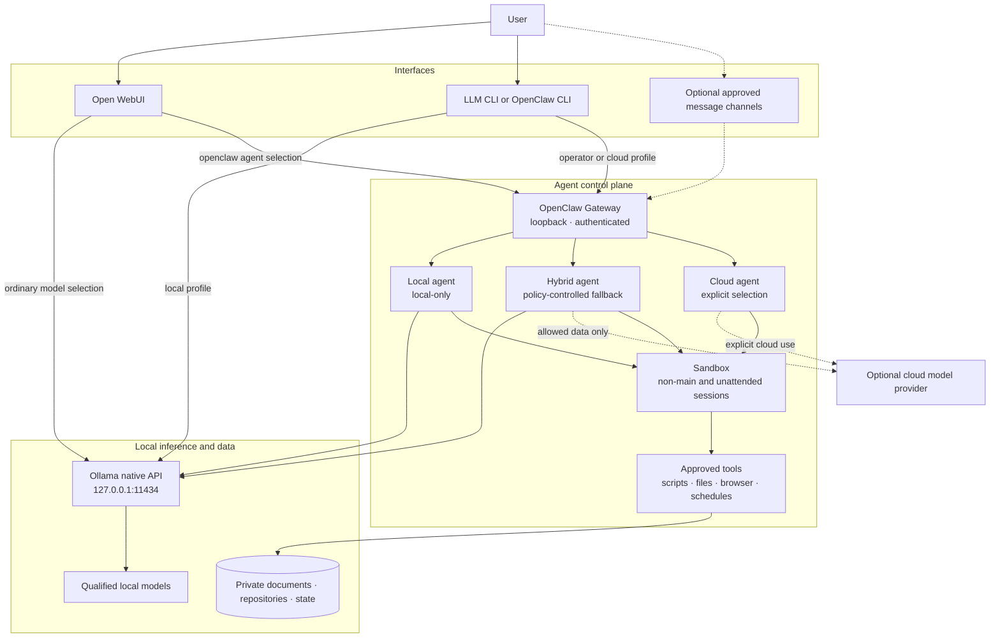

# Agent Lab OpenClaw Design Extension

## Status

- **State:** Proposed
- **Scope:** Post-MVP optional integration
- **Parent design:** [`design.md`](design.md)
- **Primary decision:** Add OpenClaw as an optional agent control plane with
  local-first model routing and explicitly authorized cloud execution.

## Summary

Agent Lab may add OpenClaw as a parallel interface and automation layer in
front of its existing Ollama inference service. OpenClaw does not replace
Ollama, Open WebUI, LLM CLI, Aider, or Open WebUI RAG. It supplies capabilities
that the existing design intentionally does not implement: long-running agent
sessions, tool orchestration, scheduled work, message-channel delivery, device
nodes, and routing between isolated agents.

The integration uses a hybrid inference policy:

- Local Ollama models remain the default for chat, private documents, local
  code, and offline operation.
- Cloud models are optional and are used only by an explicitly selected cloud
  or hybrid agent, or by a workflow whose data policy permits cloud fallback.
- A local failure must not silently send private context to a cloud provider.
- Offline mode remains a complete, testable operating mode and disables all
  cloud providers, remote channels, webhooks, and network-dependent tools.

OpenClaw runs as a native macOS service and connects to Ollama through its
native API at `http://127.0.0.1:11434`. Open WebUI and compatible local CLIs may
also connect to OpenClaw's opt-in OpenAI-compatible Gateway endpoint. Requests
sent directly to Ollama continue to bypass OpenClaw and cannot use OpenClaw
tools.

## Motivation

The base Agent Lab design provides high-quality interactive surfaces but does
not provide a common execution control plane. A user can ask a model how to
perform an operation, but the request is not automatically converted into a
bounded, auditable action.

OpenClaw can fill this gap for use cases such as:

- Run Agent Lab health checks and summarize failures.
- Execute model qualification or regression evaluations and deliver results.
- Watch local service state and notify the user when it changes.
- Schedule local document summaries or maintenance reports.
- Accept an instruction from Open WebUI or a local CLI and invoke an approved
  script, browser action, file operation, or device capability.
- Route chat, operations, coding, and document workflows to agents with
  different models, workspaces, and permissions.

These capabilities justify a new optional component only after a narrow pilot
demonstrates that they are more reliable and maintainable than fixed scripts or
the existing Open WebUI tool mechanisms.

## Goals

1. Add an always-on, local agent control plane without changing the qualified
   Ollama model artifacts.
2. Preserve direct Ollama access for ordinary Open WebUI, LLM CLI, and Aider
   workflows.
3. Allow Open WebUI and local CLIs to select an OpenClaw agent as a separate
   model-like endpoint.
4. Support local-only, cloud-only, and policy-controlled hybrid agents.
5. Make cloud use visible, intentional, and auditable.
6. Apply least privilege to agent workspaces and tools.
7. Preserve the existing offline acceptance guarantee.
8. Keep OpenClaw replaceable through documented HTTP, WebSocket, and process
   boundaries.

## Non-goals

- Replacing Open WebUI chat, users, file uploads, RAG, knowledge collections,
  citations, or search presentation.
- Replacing Ollama model installation, loading, storage, or inference.
- Routing every chat request through OpenClaw.
- Giving a general-purpose agent unrestricted access to the host.
- Sharing one privileged OpenClaw bearer token with untrusted or mutually
  adversarial Open WebUI users.
- Automatically sending private prompts, retrieved document chunks, repository
  contents, tool output, or conversation history to a cloud model.
- Building a new agent framework or forking OpenClaw.
- Making remote messaging channels part of the offline profile.

## Component role

| Capability | Owner | Integration decision |
| --- | --- | --- |
| Model installation and local inference | Ollama | Unchanged; OpenClaw uses the native Ollama API |
| Browser chat, RAG, knowledge, and citations | Open WebUI | Unchanged; OpenClaw appears as an additional selectable connection |
| General local chat CLI | LLM CLI | May select either direct Ollama or OpenClaw Gateway profiles |
| Repository-aware editing | Aider | Continues to connect directly to Ollama unless a separate experiment proves an OpenClaw path useful |
| Agent sessions, tools, schedules, channels, and nodes | OpenClaw | New optional post-MVP component |
| Cloud inference | External provider | Optional; credentials and use are profile-scoped |
| Policy, configuration, tests, and lifecycle scripts | Agent Lab | Project-owned integration layer |

OpenClaw must be version-pinned in `config/components.json` before it is enabled
by setup scripts. The pinned package, source revision, license, minimum Node.js
runtime, and artifact integrity metadata must be recorded using the same
standard as the existing components.

## Architecture



Solid lines are available in offline mode. Dotted lines require an online
profile and explicit configuration. Direct Open WebUI and CLI connections to
Ollama remain the default path. The OpenClaw path is selected deliberately and
must be labeled as action-capable in the user interface.

## Request paths

### Direct local chat

```text
Open WebUI or LLM CLI -> Ollama -> local model -> response
```

This remains the default for chat, private RAG, images, and ordinary coding
assistance. OpenClaw is not involved, so OpenClaw tools and sessions are not
available.

### Agent operation from Open WebUI

```text
Open WebUI -> OpenClaw /v1/chat/completions
           -> selected OpenClaw agent
           -> local or authorized cloud model
           -> approved OpenClaw tools
           -> response and audit state
```

OpenClaw's OpenAI-compatible Chat Completions endpoint is disabled by default
upstream and must be enabled explicitly. Open WebUI connects to it using:

```text
Base URL from macOS host: http://127.0.0.1:18789/v1
Base URL from container:  http://host.docker.internal:18789/v1
Model:                    openclaw/default or openclaw/<agent-id>
Authentication:           Gateway bearer credential stored server-side
```

Open WebUI must present direct Ollama models and OpenClaw agents as distinct
choices. Agent Lab should assign clear display names such as `Local Chat`,
`Local Operator`, and `Cloud Reasoner`; it must not make a privileged operator
agent visually indistinguishable from a passive chat model.

### Agent operation from a local CLI

The OpenClaw CLI may invoke an agent directly:

```text
openclaw agent --message "Run the Agent Lab health check and summarize failures"
```

An OpenAI-compatible CLI may instead use the Gateway base URL and select
`openclaw/default`. Agent Lab convenience commands may select the appropriate
endpoint but must delegate conversation and transport behavior to an existing
CLI.

### Narrow tool integration

For shared or less-trusted Open WebUI deployments, Agent Lab should prefer a
narrow OpenAPI or MCP tool service over the full OpenClaw Chat Completions
surface. The service may expose fixed actions such as:

- `agent_lab_health_check`
- `agent_lab_service_status`
- `agent_lab_run_evaluation`
- `agent_lab_backup_status`

The adapter may call a fixed script or a narrowly authorized OpenClaw tool
endpoint. It must not expose arbitrary agent prompts or arbitrary shell
commands. This path is more work but creates a meaningful per-operation
authorization boundary.

## Hybrid model policy

### Model classes

| Class | Example role | Cloud allowed | Default behavior |
| --- | --- | --- | --- |
| Local-only | Private chat, private RAG, repository operations | No | Fail clearly if Ollama is unavailable |
| Hybrid-safe | Public research, non-sensitive monitoring summaries | Yes, with configured fallback | Try local first; use an approved cloud fallback only for allowed inputs |
| Cloud-explicit | Difficult reasoning with user-selected cloud execution | Yes | Use the selected cloud provider; do not imply offline privacy |

### Routing requirements

1. `ollama/qwen3.5:9b` remains the default general local agent model.
2. `ollama/qwen3.5:4b` may be used for lightweight classification and status
   formatting after it passes agent-specific tests.
3. `ollama/gemma4:12b` remains the approved local vision model and may serve
   image-capable OpenClaw agents only when OpenClaw qualification passes.
4. Cloud models must be referenced by pinned provider/model identifiers where
   the provider permits stable identifiers.
5. A cloud fallback list is configured per agent or per scheduled job, not as
   an unconditional global escape hatch.
6. Explicit user model selection is strict: if the selected local-only agent
   fails, the request fails locally instead of changing its privacy class.
7. Private RAG context, repository contents, secrets, credentials, raw command
   output, and personal messages are cloud-denied unless a separate policy and
   explicit user action authorize that exact workflow.
8. Logs must record the selected agent, provider, model, fallback transition,
   tool names, outcome, and timing without recording secrets or unnecessary
   private payloads.

### Illustrative configuration

The exact schema must be verified against the pinned OpenClaw release. The
following expresses the intended policy and is not a committed production
configuration:

```json5
{
  models: {
    providers: {
      ollama: {
        baseUrl: "http://127.0.0.1:11434",
        apiKey: "ollama-local",
        api: "ollama",
        timeoutSeconds: 300,
        models: [
          {
            id: "qwen3.5:9b",
            name: "qwen3.5:9b",
            input: ["text"],
            params: {
              num_ctx: 32768,
              thinking: false,
              keep_alive: "15m"
            }
          },
          {
            id: "gemma4:12b",
            name: "gemma4:12b",
            input: ["text", "image"]
          }
        ]
      }
    }
  },
  agents: {
    defaults: {
      sandbox: { mode: "non-main" }
    },
    list: [
      {
        id: "local-chat",
        model: {
          primary: "ollama/qwen3.5:9b",
          fallbacks: []
        }
      },
      {
        id: "local-operator",
        model: {
          primary: "ollama/qwen3.5:9b",
          fallbacks: []
        }
      },
      {
        id: "hybrid-public",
        model: {
          primary: "ollama/qwen3.5:9b",
          fallbacks: ["<cloud-provider>/<approved-model>"]
        }
      },
      {
        id: "cloud-reasoner",
        model: {
          primary: "<cloud-provider>/<approved-model>",
          fallbacks: []
        }
      }
    ]
  },
  gateway: {
    bind: "loopback",
    auth: { mode: "token" },
    http: {
      endpoints: {
        chatCompletions: { enabled: true }
      }
    }
  },
  discovery: {
    mdns: { mode: "off" }
  }
}
```

The Ollama base URL deliberately omits `/v1`. OpenClaw must use Ollama's native
API for reliable tool-calling behavior. `contextWindow` and Ollama `num_ctx`
must be aligned with measured memory use on the 24 GB target, and the existing
`OLLAMA_MAX_LOADED_MODELS=1` requirement remains in force.

## Profiles and network behavior

Agent Lab extends its existing profiles as follows.

### Offline

- OpenClaw may run, but only local-only agents are enabled.
- Ollama is the only model provider.
- Cloud credentials are not resolved into the OpenClaw process.
- Message channels, remote webhooks, web search, remote browser fetches, cloud
  fallback, update checks, and non-local MCP/OpenAPI servers are disabled.
- Scheduled local commands may run if they require no network.
- Offline verification must prove that OpenClaw core workflows generate no
  outbound connections.

### Online/manual

- Local-only agents remain the default.
- Cloud-explicit agents and online tools are available only when the user
  selects them.
- Hybrid fallback is disabled unless enabled for a named workflow.
- The interface must indicate that selected content may leave the device.

### Online/automatic

- Named hybrid-safe agents and scheduled jobs may use configured cloud
  fallbacks.
- Only workflows with documented input classification may enable this profile.
- Provider, model, reason for fallback, and delivery target are written to the
  operational audit record.
- Private RAG and repository agents remain local-only unless separately and
  explicitly authorized.

## Tool and workspace policy

OpenClaw's main-session host execution defaults are designed for a trusted
single operator and do not by themselves provide hostile multi-user isolation.
Agent Lab therefore applies the following rules:

1. Create a dedicated OpenClaw workspace under Agent Lab-managed state rather
   than granting access to the user's entire home directory.
2. Mount or allow only the specific project directories required by an agent.
3. Use a sandbox for non-main, channel, scheduled, and unattended sessions.
4. Deny tools by default and allow them per agent.
5. Prefer exact executable and argument allowlists over general shell access.
6. Separate read-only diagnosis from mutation. The first pilot exposes no
   write, install, Git push, messaging, or destructive operations.
7. Require an explicit approval boundary for file mutation, package
   installation, external messages, account changes, and other material side
   effects.
8. Never place provider keys, Gateway tokens, Open WebUI secrets, or channel
   credentials in prompts, workspace files, Git, or tool output.
9. Treat fetched pages, documents, messages, issue text, and tool output as
   untrusted prompt input.
10. Do not install community skills until their source, commands, network
    behavior, transitive dependencies, and update mechanism have been reviewed.

## Authentication and user isolation

The OpenClaw Gateway remains bound to loopback and uses token authentication.
From the Open WebUI container, it is reachable through
`host.docker.internal:18789`; no Gateway port is published to the LAN.

The Gateway bearer credential used by the OpenAI-compatible HTTP surface is an
owner/operator credential, not a narrow end-user token. Consequently:

- Store it only in Open WebUI server-side connection configuration or an
  Agent Lab secret store.
- Never return it to browser JavaScript or include it in exported chats.
- Do not use the full Gateway endpoint for untrusted multi-user Open WebUI
  deployments.
- For multiple mutually untrusted users, use separate OS users/Gateways or a
  narrow authenticated tool adapter with per-user authorization.
- Rate-limit authentication attempts and rotate the credential using a
  documented recovery procedure.
- Keep remote access behind an explicitly configured VPN or SSH tunnel; remote
  transport does not replace Gateway authentication.

Messaging channels use pairing and allowlists. Public direct messages and open
group policies are prohibited by the default Agent Lab configuration.

## Privacy and data handling

For each cloud-enabled agent or job, its manifest must declare:

- Allowed input classifications.
- Provider and model.
- Whether prompts, attachments, images, retrieved chunks, tool output, and
  session history may be transmitted.
- Provider retention or zero-retention assumptions, where available.
- Maximum context and attachment size.
- Whether fallback is automatic or requires explicit selection.
- Audit and redaction behavior.

Local preprocessing does not make a workflow cloud-safe by itself. Summaries,
embeddings, filenames, stack traces, Git diffs, and command output may still
contain sensitive information. A redaction stage may reduce exposure but must
not silently change a cloud-denied workflow into a cloud-allowed one.

OpenClaw session state and Open WebUI conversation state are distinct stores.
The integration must not claim that history, deletion, retention, or user
identity is synchronized unless a tested adapter explicitly implements it.
Open WebUI conversation identifiers should map to stable OpenClaw session keys
only when continuity is required; otherwise requests should remain stateless.

## Lifecycle and resource management

OpenClaw runs natively on macOS under `launchd` so it can reach the native
Ollama service and approved host tools without adding another inference
container. Agent Lab setup owns only the pinned installation and configuration;
OpenClaw retains ownership of its Gateway runtime and state format.

The lifecycle order is:

1. Start Ollama and verify the native health endpoint.
2. Start OpenClaw Gateway and verify authenticated readiness.
3. Start Open WebUI and verify its direct Ollama and optional OpenClaw
   connections separately.
4. Enable scheduled work and message channels only after all policy checks pass.

OpenClaw does not change the one-large-model-at-a-time policy. Agent-specific
model switching must be included in latency and memory benchmarks. Cloud-only
runs should not load a local model unless local preprocessing or fallback
actually requires one.

Backups must include OpenClaw configuration, workspace-owned policy files,
approved skills, schedule definitions, session/audit state needed for recovery,
and secret references. Backups must not export plaintext provider or channel
credentials.

## Failure behavior

| Failure | Required behavior |
| --- | --- |
| Ollama unavailable for a local-only agent | Fail locally with a clear diagnostic; never switch to cloud |
| Ollama unavailable for an authorized hybrid job | Use only its configured fallback and record the transition |
| Cloud unavailable | Try an explicitly configured local fallback, or fail without looping |
| Gateway unavailable | Direct Ollama chat remains usable; action-capable models show unavailable |
| Tool denied or approval unavailable | Report the blocked action as blocked, not successful |
| Scheduled task exceeds its budget | Abort, clean up tracked processes, and record a failed run |
| Open WebUI cannot map a session | Use a new stateless OpenClaw session rather than merge unrelated users |
| Offline profile detects outbound traffic | Fail offline verification and disable the OpenClaw profile |
| Model emits malformed or repeated tool calls | Stop at a bounded loop limit and preserve diagnostic evidence |

## Phased implementation

### Phase 0: Qualification and decision record

- Select and pin an OpenClaw release and Node.js runtime.
- Record source revision, artifact integrity, license, endpoints, state paths,
  and required environment.
- Verify native Ollama tool calling with each approved Agent Lab model.
- Measure context use, time to first token, model switching, memory, and tool
  reliability on the target Mac.
- Add an architecture decision record before promoting the integration.

Exit condition: OpenClaw can run a deterministic read-only tool sequence through
Ollama without cloud access or host-wide permissions.

### Phase 1: Read-only local operator pilot

- Add one `local-operator` agent.
- Allow only Agent Lab status, health-check, and read-only evaluation tools.
- Expose it to the local CLI first.
- Add the Open WebUI Gateway connection only after CLI acceptance passes.
- Keep schedules, message channels, browser control, and cloud providers off.

Exit condition: a user can request a health check from CLI and Open WebUI, see
the executed steps and result, and cannot mutate files or escape the workspace.

### Phase 2: Explicit cloud reasoning

- Add one cloud provider using a secret reference.
- Add a clearly labeled `cloud-reasoner` agent with no private file tools.
- Add per-agent provider/model audit records and usage limits.
- Verify that offline mode cannot resolve the credential or reach the provider.

Exit condition: explicit cloud selection works, direct local workflows remain
unchanged, and private local fixtures are rejected from cloud transmission.

### Phase 3: Policy-controlled hybrid workflows

- Add hybrid fallback only to named non-sensitive agents or jobs.
- Add bounded scheduled tasks and failure delivery.
- Test provider failure, local failure, timeouts, rate limits, and fallback
  recovery.

Exit condition: every fallback is explainable from configuration and audit
state, and no local-only workflow crosses the cloud boundary.

### Phase 4: Optional channels and richer tools

- Add one paired private messaging channel.
- Evaluate browser automation, device nodes, or additional skills separately.
- Require a threat review for every newly enabled action surface.

Exit condition: channel identity, session isolation, sandboxing, and outbound
actions pass adversarial prompt and authorization tests.

## Acceptance criteria

### Functional

- OpenClaw discovers and uses the approved Ollama text model through the native
  API.
- The approved vision model processes an inbound image only when explicitly
  marked image-capable.
- Open WebUI lists direct Ollama models and OpenClaw agents separately.
- A local CLI can select direct Ollama or `openclaw/<agent-id>` explicitly.
- The read-only operator executes the expected fixed tools and returns their
  actual exit status.
- Gateway failure does not break direct Ollama chat.
- Scheduled jobs persist across a Gateway restart without duplicate actions.

### Hybrid routing

- Local-only agents never contact a cloud provider, including after timeout,
  rate limit, malformed tool output, or Ollama shutdown.
- A hybrid-safe fixture uses its configured cloud fallback when Ollama is
  deliberately unavailable.
- A cloud-explicit fixture records provider and model selection.
- Unconfigured models and fallbacks fail closed.
- Cloud fallback does not load or retain a second local model in violation of
  the memory policy.

### Security and privacy

- Gateway binds only to the intended loopback interface.
- Requests without the Gateway credential fail.
- The credential is absent from Git, logs, chat exports, process arguments, and
  generated configuration artifacts.
- Unknown message senders cannot invoke the agent.
- A prompt-injection fixture cannot expand the agent's tool allowlist, escape
  its workspace, read secrets, or enable cloud transmission.
- Read-only agents cannot mutate repository or Agent Lab state.
- Tool denial, timeout, and nonzero exit are never reported as success.
- Offline verification detects any attempted cloud, webhook, channel, update,
  search, or remote tool connection.

### Operations

- `doctor` reports Gateway version, readiness, configured bind, selected
  profile, Ollama reachability, enabled providers, and risky policy settings
  without revealing secrets.
- Backup and restore preserve approved configuration, schedules, and required
  state while keeping secrets external.
- Disabling the OpenClaw component restores the original direct
  Open WebUI/CLI-to-Ollama architecture without data migration.

## Rollback

OpenClaw is an optional parallel component. Rollback consists of:

1. Disable OpenClaw models/connections in Open WebUI.
2. Disable OpenClaw schedules and message channels.
3. Stop and disable the Gateway service.
4. Restore CLI profiles to the direct Ollama endpoint.
5. Preserve OpenClaw state for forensic inspection or a later re-enable.

No Ollama models, Open WebUI conversations, RAG collections, or Aider state
must be migrated to perform this rollback.

## Open questions

- Which cloud provider and model provide an acceptable privacy, cost, latency,
  and tool-reliability tradeoff?
- Should the first cloud workflow use API-key billing or an approved
  subscription/OAuth route?
- Is the Open WebUI deployment permanently single-user, or must the integration
  support mutually untrusted users?
- Which operations require synchronous user approval, and can that approval be
  represented reliably in Open WebUI and each CLI?
- Which OpenClaw state is required for backup and which session data should
  expire automatically?
- Does a narrow OpenAPI/MCP adapter provide enough value to justify maintaining
  it for shared deployments?
- Which Agent Lab evaluation cases predict reliable multi-step tool use by the
  qualified 4B, 9B, and 12B local models?

## Upstream references

- [OpenClaw repository](https://github.com/openclaw/openclaw)
- [OpenClaw Gateway architecture](https://docs.openclaw.ai/concepts/architecture)
- [OpenClaw Ollama provider](https://docs.openclaw.ai/providers/ollama)
- [OpenClaw OpenAI-compatible HTTP API](https://docs.openclaw.ai/gateway/openai-http-api)
- [OpenClaw tool invocation HTTP API](https://docs.openclaw.ai/gateway/tools-invoke-http-api)
- [OpenClaw model providers](https://docs.openclaw.ai/providers/models)
- [OpenClaw model failover](https://docs.openclaw.ai/model-failover)
- [OpenClaw security guidance](https://docs.openclaw.ai/gateway/security)
- [OpenClaw scheduled tasks](https://docs.openclaw.ai/automation/cron-jobs)
- [Open WebUI external tool servers](https://docs.openwebui.com/ecosystem/computer/automate/tool-servers/)

