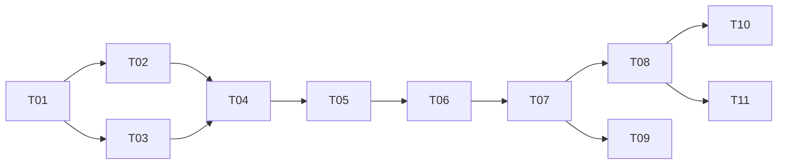

# 任务卡总览

本目录把 [`docs/design.md`](../design.md) 拆成可以独立评审、独立合入的任务。**每张任务卡对应一个 PR。**

## 约定

- 每个 PR 只做卡片"范围"里列出的内容；发现卡片之外的问题，记录到卡片的"备注"或新开卡片，不顺手扩大 PR。
- 每个 PR 合入前必须满足卡片的全部验收标准，并通过 CI。
- 涉及设计变更的 PR（例如基准测试改变了档位数值）要在同一个 PR 里更新 `docs/design.md`。
- 标注"设备测试"的验收项，需要在 MacBook Air M5 24GB 上实际运行，并把结果（命令输出或报告文件）贴到 PR 描述里。
- 卡片状态在下表中维护：待开始 / 进行中 / 已合入。每个 PR 在合入时顺带更新自己那一行。

## 任务列表

| 编号 | 标题 | 依赖 | 需要设备测试 | 状态 |
| --- | --- | --- | --- | --- |
| T00 | 技术设计与任务卡（PR #2，以及本次修订） | — | 否 | 已合入 |
| [T01](T01-skeleton-and-toolchain.md) | 项目骨架与隔离工具链 | T00 | 是（隔离检查） | 待开始 |
| [T02](T02-model-registry-and-pull.md) | 模型注册表与下载 | T01 | 是（下载 27B） | 待开始 |
| [T03](T03-gpu-limit-and-doctor.md) | GPU 内存上限管理与环境检查 | T01 | 是 | 待开始 |
| [T04](T04-mlx-backend.md) | mlx-lm 后端与进程管理（含工具调用验证） | T02、T03 | 是 | 待开始 |
| [T05](T05-gateway.md) | OpenAI 兼容网关（鉴权、限额、工具调用、心跳） | T04 | 是（冒烟测试） | 待开始 |
| [T06](T06-benchmark-and-profile.md) | 基准测试与档位定稿 | T05 | 是（主要工作在设备上） | 待开始 |
| [T07](T07-public-access-tunnel.md) | 公网访问：api.llmat.dev（Cloudflare Tunnel） | T05（建议 T06 之后） | 是，含一次 Cloudflare 后台操作 | 待开始 |
| [T08](T08-client-integration.md) | Cursor 与 opencode 接入 | T07 | 是（端到端） | 待开始 |
| [T09](T09-offline-bundle.md) | 离线打包与迁移 | T07 | 是 | 待开始 |
| [T10](T10-fast-profile.md) | 快速档模型评估（Gemma 4 26B-A4B） | T08 | 是 | 待开始，可选 |
| [T11](T11-user-guide.md) | 使用文档 | T08 | 是（按文档走一遍） | 待开始 |

Ollama 后端在 2026-10-04 的修订中移除，原 T07 卡片已删除。

## 依赖关系

T02 和 T03 可以并行；T08 和 T09 可以并行；T10 和 T11 可以并行。

## 里程碑

- **M1 本机能用（T01–T05）**：一条命令启动 Qwen3.8-27B，通过 `127.0.0.1:8000` 带 key 调用，工具调用可用。
- **M2 定稿（T06）**：用实测数据确定 context 档位和内存参数。
- **M3 对外可用（T07、T08）**：Cursor 和 opencode 通过 `https://api.llmat.dev/v1` 接入。
- **M4 可迁移（T09、T11）**：能打离线包部署到其他 Mac，有完整使用文档。

## 需要你本人操作的步骤

- `alab gpu-limit apply/revert`：涉及 `sudo`，一律由你本人在终端里确认执行。
- T07：在 Cloudflare 后台创建 tunnel、添加 `api.llmat.dev` 的 Public Hostname、复制 token。
- T08：Cursor 需要 Pro 计划，在 Cursor 设置里填 key 和 base URL。
- 其余设备测试可以通过 Remote Control 在你的 Mac 上执行，或由你按 PR 描述中的命令运行后把输出贴回。
