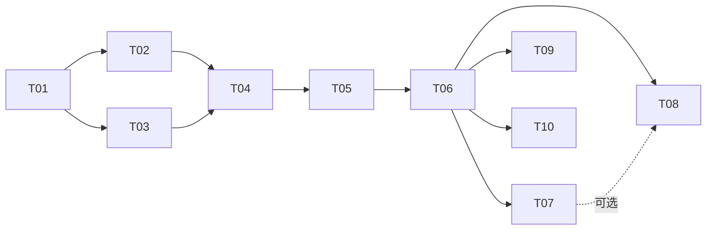

# 任务卡总览

本目录把 [`docs/design.md`](../design.md) 拆成可以独立评审、独立合入的任务。**每张任务卡对应一个 PR。**

## 约定

- 每个 PR 只做卡片"范围"里列出的内容；发现卡片之外的问题，记录到卡片的"备注"或新开卡片，不顺手扩大 PR。
- 每个 PR 合入前必须满足卡片的全部验收标准，并通过 CI。
- 涉及设计变更的 PR（例如基准测试改变了档位数值）要在同一个 PR 里更新 `docs/design.md`。
- 标注"设备测试"的验收项，需要在 MacBook Air M5 24GB 上实际运行，并把结果（命令输出或报告文件）贴到 PR 描述里。
- 卡片状态在下表中维护：待开始 / 进行中 / 已合入。每个 PR 在合入时顺带更新自己那一行。

## 任务列表

| 编号 | 标题 | 依赖 | 需要设备测试 | 状态 |
| --- | --- | --- | --- | --- |
| T00 | 技术设计与任务卡（本 PR） | — | 否 | 已合入 |
| [T01](T01-skeleton-and-toolchain.md) | 项目骨架与隔离工具链 | T00 | 是（隔离检查） | 待开始 |
| [T02](T02-model-registry-and-pull.md) | 模型注册表与下载 | T01 | 是（下载 27B） | 待开始 |
| [T03](T03-gpu-limit-and-doctor.md) | GPU 内存上限管理与环境检查 | T01 | 是 | 待开始 |
| [T04](T04-mlx-backend.md) | mlx-lm 后端与进程管理 | T02、T03 | 是 | 待开始 |
| [T05](T05-gateway.md) | OpenAI 兼容网关 | T04 | 是（冒烟测试） | 待开始 |
| [T06](T06-benchmark-and-profile.md) | 基准测试与档位定稿 | T05 | 是（主要工作在设备上） | 待开始 |
| [T07](T07-ollama-backend.md) | Ollama 备选后端与后端对比 | T06 | 是 | 待开始 |
| [T08](T08-offline-bundle.md) | 离线打包与迁移 | T06（T07 可选） | 是 | 待开始 |
| [T09](T09-fast-profile.md) | 快速档模型评估（Gemma 4 26B-A4B） | T06 | 是 | 待开始，可选 |
| [T10](T10-user-guide.md) | 使用文档与客户端接入 | T06 | 否 | 待开始 |

## 依赖关系

T02 和 T03 可以并行。T07、T08、T09、T10 在 T06 之后都可以并行。

## 里程碑

- **M1 能用（T01–T05）**：在本机一条命令启动 Qwen3.8-27B，通过 `127.0.0.1:8000` 的 OpenAI 兼容接口对话。
- **M2 定稿（T06）**：用实测数据确定 context 档位、GPU 上限和默认后端参数。
- **M3 可迁移（T07、T08、T10）**：有备选后端，能打离线包部署到其他 Mac，有使用文档。

## 设备测试的执行方式

需要在 Mac 上运行的步骤，通过 Remote Control 在本机的仓库目录里执行，或由你本人按 PR 描述中的命令运行后把输出贴回。涉及 `sudo` 的命令（只有 `alab gpu-limit apply/revert`）一律由你本人在终端里确认执行。
