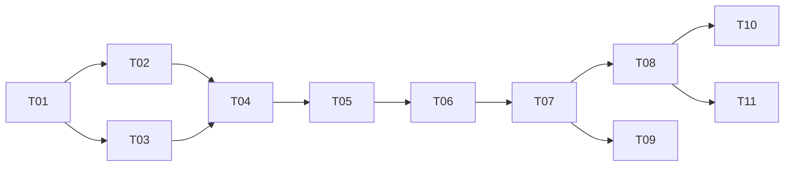

# Task cards

This directory splits [`docs/design.md`](../design.md) into tasks that can each be reviewed and merged on their own. **Each task card is one PR.**

## Conventions

- A PR only does what its card's scope lists. Problems found outside that scope go into the card's notes or a new card, not into the same PR.
- A PR merges only when every acceptance criterion on its card is met and CI passes.
- A PR that changes the design (for example, benchmarks changing profile values) updates `docs/design.md` in the same PR.
- Acceptance items marked "device test" must run on the MacBook Air M5 24GB, with the results (command output or report files) pasted into the PR description.
- Card status is tracked in the table below: not started / in progress / merged. Each PR updates its own row when it merges.

## Tasks

| ID | Title | Depends on | Device test | Status |
| --- | --- | --- | --- | --- |
| T00 | Design and task cards (PR #2 and this revision) | — | No | Merged |
| [T01](T01-skeleton-and-toolchain.md) | Project skeleton and isolated toolchain | T00 | Yes (isolation check) | Not started |
| [T02](T02-model-registry-and-pull.md) | Model registry and downloads | T01 | Yes (download the 27B) | Not started |
| [T03](T03-gpu-limit-and-doctor.md) | GPU memory limit and environment checks | T01 | Yes | Not started |
| [T04](T04-mlx-backend.md) | mlx-lm backend and process management (incl. tool-call check) | T02, T03 | Yes | Not started |
| [T05](T05-gateway.md) | OpenAI-compatible gateway (auth, limits, tool calls, heartbeats) | T04 | Yes (smoke test) | Not started |
| [T06](T06-benchmark-and-profile.md) | Benchmarks and final profile | T05 | Yes (mostly on the device) | Not started |
| [T07](T07-public-access-tunnel.md) | Public access: api.llmat.dev (Cloudflare Tunnel) | T06 | Yes, plus one Cloudflare dashboard step | Not started |
| [T08](T08-client-integration.md) | Cursor and opencode integration | T07 | Yes (end to end) | Not started |
| [T09](T09-offline-bundle.md) | Offline bundle and migration | T07 | Yes | Not started |
| [T10](T10-fast-profile.md) | Fast profile evaluation (Gemma 4 26B-A4B) | T08 | Yes | Not started, optional |
| [T11](T11-user-guide.md) | User guide | T08 | Yes (follow the guide once) | Not started |

The Ollama backend was dropped in the 2026-10-04 revision, and its card was removed.

## Dependencies

T02 and T03 can run in parallel; so can T08 and T09, and T10 and T11.

## Milestones

- **M1 Works locally (T01–T05)**: one command starts Qwen3.8-27B, callable with a key at `127.0.0.1:8000`, with working tool calls.
- **M2 Settled (T06)**: context size and memory settings decided by measurements.
- **M3 Public (T07, T08)**: Cursor and opencode connected through `https://api.llmat.dev/v1`.
- **M4 Portable (T09, T11)**: an offline bundle can be deployed to another Mac, and a complete user guide exists.

## Steps that need the owner

- `alab gpu-limit apply/revert` uses `sudo` and is always confirmed by the owner in their own terminal.
- T07: create the tunnel in the Cloudflare dashboard, add the `api.llmat.dev` Public Hostname, and copy the token.
- T08: Cursor needs the Pro plan; enter the key and base URL in Cursor's settings.
- Other device tests can run on the Mac through Remote Control, or the owner runs the commands from the PR description and pastes the output.
